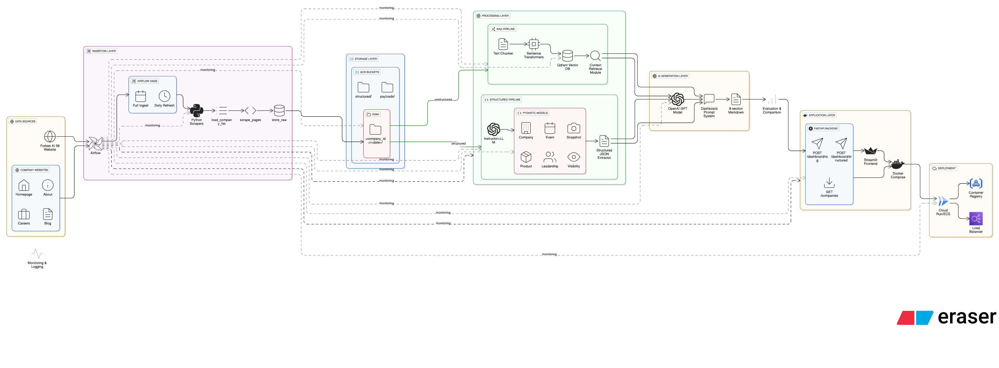

# PROJECT ORBIT - AI50 Intelligence Platform

**Intelligent Agentic System for Private-Equity Due Diligence**

A production-grade, cloud-native platform that combines automated data ingestion, intelligent agent orchestration, and human-in-the-loop workflows to deliver comprehensive due diligence intelligence for all 50 companies in the Forbes AI 50 list.

## 🎯 What This System Does

**Core Capabilities:**
- **Automated Data Pipeline:** Web scraping, structured extraction, and vector database indexing
- **Dual Dashboard Generation:** RAG (Retrieval-Augmented Generation) and Structured (Pydantic-based) pipelines
- **Intelligent Agents:** Supervisor agents using ReAct pattern for transparent reasoning
- **Model Context Protocol (MCP):** Secure, standardized tool access via HTTP
- **Graph-Based Workflows:** LangGraph orchestration with conditional branching
- **Human-in-the-Loop (HITL):** Risk detection with human approval gates
- **Full Observability:** Execution traces, ReAct logs, and Mermaid diagram visualizations

**Key Features:**
- 🤖 **Agentic Intelligence:** LLM-powered agents that reason, plan, and execute due diligence workflows
- 🔒 **Secure Tool Access:** MCP server exposing dashboard generation, company resources, and prompts
- 📊 **Risk Management:** Automatic risk detection (layoffs, breaches, lawsuits) with human oversight
- 📈 **Transparent Reasoning:** Complete ReAct logs showing agent decision-making process
- 🎨 **Visual Workflows:** Mermaid diagrams visualizing execution paths and decision trees
- ☁️ **Cloud-Native:** Fully deployed on GCP with Airflow orchestration, Cloud Run services, and GCS storage

---

## 📋 Project Resources

* **Google Codelab**: [Project ORBIT Tutorial](https://codelabs-preview.appspot.com/?file_id=1J2wywiaEeSrTKwo606GT0mz2sGQO-gLPnByV4lKj4Fk)
* **YouTube Demo**: https://youtu.be/ZOiY655wVBI
* **GitHub Repository**: https://github.com/BigDataGroup1/orbit-ai50-intelligence

---

## 🛠️ Technologies

<p align="center">
  
  
  
  
  
  
  
  
  
  
  
</p>

---

## 🏗️ Architecture Diagram



---

## 📁 File Structure
```text
ORBIT-AI50-INTELLIGENCE/
├── data/
│   ├── backups/
│   ├── collection/
│   ├── dashboards/
│   │   ├── rag/
│   │   │   ├── Anthropic.md
│   │   │   ├── Anthropic_eval.json
│   │   │   └── ...
│   │   └── structured/
│   │       ├── anthropic_dashboard.md
│   │       ├── anthropic_eval.json
│   │       └── ...
│   ├── payloads/
│   │   ├── anthropic.json
│   │   ├── abridge.json
│   │   └── ...
│   ├── profiles/
│   │   ├── Anthropic/
│   │   │   ├── forbes_profile.html
│   │   │   └── forbes_profile.txt
│   │   └── ...
│   ├── qdrant_storage/
│   │   ├── collection/
│   │   ├── meta.json
│   │   └── storage.sqlite
│   ├── raw/
│   │   ├── Anthropic/
│   │   │   ├── 2025-11-03_initial/
│   │   │   │   ├── homepage.html
│   │   │   │   ├── homepage.txt
│   │   │   │   ├── about.txt
│   │   │   │   ├── pricing.txt
│   │   │   │   ├── careers.txt
│   │   │   │   └── intelligence.json
│   │   │   └── 2025-11-04_daily/
│   │   │       ├── careers.txt
│   │   │       ├── blog.txt
│   │   │       └── metadata.json
│   │   └── ...
│   ├── structured/
│   │   ├── anthropic.json
│   │   ├── abridge.json
│   │   └── ...
│   ├── forbes_ai50_seed.json
│   └── lab1_bulletproof_summary_2025-11-03.json
├── src/
│   ├── api/
│   │   ├── main.py
│   │   └── requirements.txt
│   ├── app/
│   │   ├── streamlit_app.py
│   │   ├── Dockerfile
│   │   └── requirements.txt
│   ├── dags/
│   │   ├── ai50_full_ingest_dag.py
│   │   ├── ai50_daily_refresh_dag.py
│   │   ├── forbes_scraper.py
│   │   └── scraper_robust.py
│   ├── dashboard/
│   │   ├── context_assembler.py
│   │   ├── rag_generator.py
│   │   ├── generate_dashboards.py
│   │   └── generate_eval_dashboard.py
│   ├── evaluation/
│   │   ├── compare_pipelines.py
│   │   └── EVAL.md
│   ├── prompts/
│   │   ├── dashboard_system.md
│   │   └── dashboard_system_structured.md
│   ├── scrapers/
│   │   ├── forbes_scraper.py
│   │   └── scraper_robust.py
│   ├── structured/
│   │   ├── models.py
│   │   ├── structured_extract.py
│   │   ├── structured_dashboard.py
│   │   ├── structured_payload_lab6.py
│   │   ├── generate_all_dashboard.py
│   │   └── generate_eval_structured.py
│   └── vectordb/
│       ├── chunker.py
│       ├── embedder.py
│       └── build_index.py
│   ├── agents/
│   │   ├── supervisor_agent.py
│   │   ├── tools.py
│   │   ├── mcp_integration.py
│   │   ├── react_logger.py
│   │   ├── advanced_tools.py
│   │   ├── interactive_agent.py
│   │   └── interactive_agent_enhanced.py
│   ├── server/
│   │   └── mcp_server.py
│   ├── workflows/
│   │   └── due_diligence_graph.py
│   └── tests/
│       ├── test_tools.py
│       ├── test_mcp_server.py
│       └── test_workflow_graph.py
├── airflow/
│   ├── dags/
│   │   ├── orbit_initial_load_dag.py
│   │   ├── orbit_daily_update_dag.py
│   │   └── orbit_agentic_dashboard_dag.py
│   └── README.md
├── docs/
│   ├── execution_trace_*.md
│   └── ASSIGNMENT_5_SUMMARY.md
├── logs/
│   └── react_traces/
├── mcp_config.json
├── .dockerignore
├── .env
├── .gitignore
├── docker-compose.yml
├── Dockerfile
├── EVAL.md
├── README.md
└── requirements.txt
```

---

## 🚀 Installation & Setup

### Prerequisites
- Python 3.10 or higher (3.11+ recommended)
- Google Cloud Platform account with billing enabled
- OpenAI API key
- Docker Desktop (optional, for containerized deployment)
- Google Cloud SDK (for GCS access)
- Git

### Installation Steps

1. **Clone the repository**
```bash
git clone https://github.com/BigDataGroup1/orbit-ai50-intelligence.git
cd orbit-ai50-intelligence
```

2. **Create Virtual Environment**
```bash
python -m venv venv

# Activate virtual environment
# On Windows:
venv\Scripts\activate
# On Linux/Mac:
source venv/bin/activate
```

3. **Install Dependencies**
```bash
pip install --upgrade pip
pip install -r requirements.txt
```

**Key Dependencies:**
- `fastapi`, `uvicorn` - API framework
- `openai` - LLM integration
- `langgraph` - Workflow orchestration
- `qdrant-client` - Vector database
- `sentence-transformers` - Embeddings
- `google-cloud-storage` - GCS access
- `streamlit` - Web UI
- `instructor` - Structured extraction
- `pydantic` - Data validation

4. **Set up Environment Variables**

Create a `.env` file in the project root:
```bash
# OpenAI API
OPENAI_API_KEY=your_openai_api_key_here

# GCP Configuration
GCP_BUCKET_NAME=orbit-raw-data-g1-2025
GCP_PROJECT_ID=your-gcp-project-id
GOOGLE_APPLICATION_CREDENTIALS=path/to/service-account-key.json

# Optional: Hugging Face token (for embeddings)
HF_TOKEN=your_hf_token_here

# MCP Server Configuration (optional)
MCP_SERVER_URL=http://localhost:8001
PORT=8001

# HITL Configuration (optional)
HITL_AUTO_APPROVE=false
```

5. **Set up GCP Credentials (if using GCS)**
```bash
# Option 1: Use service account JSON
export GOOGLE_APPLICATION_CREDENTIALS="path/to/service-account-key.json"

# Option 2: Use gcloud auth
gcloud auth application-default login
```

6. **Build Vector Database**
```bash
# From GCS (recommended for production)
python src/vectordb/build_index.py --gcs

# From local data (if you have data/raw/ directory)
python src/vectordb/build_index.py --local
```

7. **Generate Structured Payloads (Optional)**
```bash
# From GCS
python src/structured/structured_extract_gcp.py --all

# From local data
python src/structured/structured_extract.py --all
```

---

## ☁️ Cloud Deployment

**Our application is deployed on GCP project: `orbit-ai50-intelligence`**

### GCS Buckets
- **Raw Data:** `orbit-raw-data-g1-2025` (scraped HTML/text)
- **Processed Data:** `orbit-processed-data-g1-2025` (reports, seed files, Qdrant index)

### 1. Setup GCS Buckets
```bash
gcloud config set project orbit-ai50-intelligence

# Create buckets
gsutil mb -l us-central1 gs://orbit-raw-data-g1-2025
gsutil mb -l us-central1 gs://orbit-processed-data-g1-2025
```

### 2. Setup Cloud Composer (Airflow)
```bash
# Create environment
gcloud composer environments create orbit-airflow-env \
  --location us-central1 \
  --python-version 3.11 \
  --machine-type n1-standard-4 \
  --node-count 3

# Upload DAGs
gsutil cp src/dags/*.py gs://us-central1-orbit-airflow-env-bucket/dags/
```

### 3. Run Initial Scraping
```bash
# Trigger DAG 1: Full ingest (manual trigger in Airflow UI)
# This runs forbes_scraper.py → scraper_robust.py → uploads to GCS
# Duration: ~2 hours for all 50 companies
```

### 4. Build Vector Database from GCS
```bash
# In Google Cloud Shell or local with credentials:
export GOOGLE_APPLICATION_CREDENTIALS="path/to/service-account-key.json"

cd src/vectordb
python build_index.py --gcs

# This reads from gs://orbit-raw-data-group1-2025/data/raw/
# Outputs to data/qdrant_storage/ locally
```

### 5. Upload Qdrant Storage to GCS
```bash
# Copy vector database to GCS for Cloud Run access
gsutil -m cp -r data/qdrant_storage gs://orbit-processed-data-group1-2025/
```

### 6. Deploy FastAPI to Cloud Run
```bash
cd src/api

# Build and deploy
gcloud run deploy orbit-api \
  --source . \
  --region us-central1 \
  --allow-unauthenticated \
  --memory 2Gi \
  --cpu 2 \
  --timeout 300 \
  --set-env-vars OPENAI_API_KEY=your-key
```

### 7. Deploy Streamlit to Cloud Run
```bash
cd src/app

gcloud run deploy orbit-streamlit \
  --source . \
  --region us-central1 \
  --allow-unauthenticated \
  --set-env-vars API_URL=https://orbit-api-xxxxx.run.app
```

### 8. Enable Daily Refresh
```bash
# Enable ai50_daily_refresh_dag in Airflow UI
# Runs daily at 3 AM UTC (0 3 * * *)
```

---

## 🌐 Live Deployment

**Production URLs:**

- **Streamlit Frontend:** https://orbit-streamlit-667820328373.us-central1.run.app
- **FastAPI Backend:** https://orbit-api-667820328373.us-central1.run.app
- **API Documentation (Swagger):** https://orbit-api-667820328373.us-central1.run.app/docs
- **Health Check:** https://orbit-api-667820328373.us-central1.run.app/health
- **Stats:** https://orbit-api-667820328373.us-central1.run.app/stats
- **Companies List:** https://orbit-api-667820328373.us-central1.run.app/companies
- **Airflow Web UI:** Access via GCP Console → Cloud Composer → orbit-airflow-env

**Cloud Infrastructure:**
- FastAPI: Cloud Run (2 vCPU, 2GB RAM)
- Streamlit: Cloud Run (auto-scaling)
- Airflow: Cloud Composer (3 workers)
- Vector DB: Qdrant (26,985 vectors, 384-dim)
- Storage: GCS (raw + processed buckets)

---

## 🎯 Quick Start

### Option 1: Local Development (Recommended for Testing)

**1. Start MCP Server (Terminal 1)**
```bash
python src/server/mcp_server.py
# Server runs on http://localhost:8001
# Swagger UI: http://localhost:8001/docs
```

**2. Start FastAPI (Terminal 2 - Optional)**
```bash
cd src/api
python main.py
# API runs on http://localhost:8080
# Docs: http://localhost:8080/docs
```

**3. Start Streamlit (Terminal 3 - Optional)**
```bash
streamlit run src/app/streamlit_app.py
# UI runs on http://localhost:8501
```

**4. Run Due Diligence Workflow**
```bash
# Normal mode (with HITL if risks detected)
python src/workflows/due_diligence_graph.py --company openai

# View execution trace
# File saved to: docs/execution_trace_openai_*.md
```

**5. Or Use Interactive Chatbot**
```bash
python src/agents/interactive_agent.py
# Then type: "Generate dashboard for openai"
```

### Option 2: Cloud Deployment

**Access Production URLs:**
- **Streamlit Frontend:** https://orbit-streamlit-667820328373.us-central1.run.app
- **FastAPI Backend:** https://orbit-api-667820328373.us-central1.run.app
- **API Documentation (Swagger):** https://orbit-api-667820328373.us-central1.run.app/docs
- **Health Check:** https://orbit-api-667820328373.us-central1.run.app/health
- **Stats:** https://orbit-api-667820328373.us-central1.run.app/stats
- **Companies List:** https://orbit-api-667820328373.us-central1.run.app/companies

**Test the system:**
1. Select a company from dropdown (e.g., "Anthropic")
2. Choose pipeline: RAG or Structured
3. Click "Generate Dashboard"
4. View 8-section investor dashboard with evaluation scores

**API Testing:**
- `GET /companies` - List all 50 indexed companies (https://orbit-api-667820328373.us-central1.run.app/companies)
- `GET /stats` - System statistics (https://orbit-api-667820328373.us-central1.run.app/stats)
- `GET /health` - Health check (https://orbit-api-667820328373.us-central1.run.app/health)
- `POST /rag/search` - Semantic search test
- `POST /dashboard/rag` - Generate RAG dashboard
- `POST /dashboard/structured` - Generate structured dashboard
- **Full API Docs:** https://orbit-api-667820328373.us-central1.run.app/docs

---

## 📊 Project Flow

### Phase 1: Data Ingestion & Pipeline Bootstrap (Labs 0-3)

**Lab 0 - Project Bootstrap:**
- Created Git repository with organized folder structure
- Built Forbes AI 50 seed list from https://www.forbes.com/lists/ai50/
- Defined complete manual website overrides for all 50 companies
- JSON schema: company_name, website, ceo, founded_year, hq_city, category

**Lab 1 - Web Scraping:**
- Built Forbes profile scraper with LinkedIn fallback for website discovery
- Scraped 7 pages per company: homepage, /about, /pricing, /product, /careers, /blog, /customers
- Saved raw HTML + cleaned text to GCS with session folders: `{YYYY-MM-DD}_initial/`
- Extracted intelligence: pricing models, customer mentions, job openings, integrations
- Result: 50 companies, ~350 pages, 96% success rate

**Lab 2 - Full Ingest Airflow DAG:**
- Created Cloud Composer environment (3 workers, n1-standard-4)
- Built `ai50_full_ingest_dag.py`: run_forbes_scraper → run_website_scraper → upload_to_gcs → generate_report
- Scheduled: @once (manual trigger only)
- Duration: ~2 hours for full 50-company scrape
- Output: GCS buckets organized by company and session

**Lab 3 - Daily Refresh DAG:**
- Built `ai50_daily_refresh_dag.py` scheduled daily at 3 AM UTC (0 3 * * *)
- Smart conditional scraping: only scrapes dynamic pages (careers, blog, news) that return 200 OK
- Skips 404s automatically to save compute
- Creates daily session folders: `{YYYY-MM-DD}_daily/`
- Duration: ~45 minutes per run

### Phase 2: Knowledge Representation (Labs 4-6)

**Lab 4 - Vector DB & RAG Index:**
- Initialized Qdrant vector database with persistent storage
- Smart session merge: dynamic pages prefer daily, stable pages prefer initial
- Chunking: 800 tokens with 100-token overlap using tiktoken
- Embeddings: Sentence Transformers all-MiniLM-L6-v2 (384 dimensions)
- Result: 26,985 vectors across 50 companies, 96% success rate

**Lab 5 - Structured Extraction:**
- Designed 6 Pydantic schemas: Company, Event, Snapshot, Product, Leadership, Visibility
- Used Instructor library for LLM-powered extraction with GPT-4o-mini
- Validated all field types and implemented auto-retry for malformed responses
- Result: 39 companies with structured JSON, 90% extraction success rate

**Lab 6 - Payload Assembly:**
- Combined all Pydantic models into unified payload structure
- Added provenance policy: "Never invent ARR, MRR, valuation. If missing: 'Not disclosed.'"
- Validated 39/39 payloads successfully
- Output: `data/payloads/{company_id}.json` ready for dashboard generation

### Phase 3: Dashboard Generation (Labs 7-9)

**Lab 7 - RAG Pipeline Dashboard:**
- Multi-query retrieval: 5 targeted queries per company (overview, pricing, funding, leadership, growth)
- Retrieved top-20 most relevant chunks by cosine similarity
- Generated 8-section dashboards using GPT-4o-mini
- Auto-evaluation: LLM-as-judge scoring (factual, hallucination, readability)
- Latency: 18-25 seconds, Cost: $0.015 per dashboard

**Lab 8 - Structured Pipeline Dashboard:**
- Loaded validated payloads from Lab 6
- Used same 8-section prompt template for fair comparison
- Generated dashboards from structured JSON context
- Complete auto-evaluation: all 5 rubric criteria
- Latency: 8-12 seconds, Cost: $0.008 per dashboard (47% cheaper)

**Lab 9 - Evaluation & Comparison:**
- Evaluated 6 companies: Abridge, Anthropic, Anysphere, Baseten, Clay, Coactive AI
- Rubric: Factual (0-3), Schema (0-2), Provenance (0-2), Hallucination (0-2), Readability (0-1)
- Results: RAG average 8.17/10, Structured average 8.17/10 (exact tie)
- Key finding: Structured more factually accurate, RAG more readable

### Phase 4: Deployment & Automation (Labs 10-11)

**Lab 10 - Docker & Cloud Run:**
- Dockerized FastAPI service with multi-stage build
- Deployed to Cloud Run: 2 services (orbit-api, orbit-streamlit)
- Configured CORS, health checks, environment variables
- Pre-bundled embedding models to reduce cold start time

**Lab 11 - DAG-App Integration:**
- Daily DAG writes completion timestamp to GCS
- FastAPI reads timestamp to show "Last updated" in UI
- Streamlit polls /stats endpoint every 5 minutes for refresh detection
- End-to-end: Daily DAG runs → rebuilds index → updates timestamp → UI shows refresh badge

### Phase 5: Agent Infrastructure & MCP Integration

**Agent Tools & Supervisor:**
- Built three core async tools: `get_latest_structured_payload`, `rag_search_company`, `report_layoff_signal`
- Created Supervisor Agent using ReAct pattern (Think → Act → Observe)
- Integrated advanced tools: financial metrics, risk scoring, competitor comparison, investment recommendations
- Structured ReAct logging with correlation IDs (`run_id`, `company_id`) saved to JSON traces

**Model Context Protocol (MCP) Server:**
- FastAPI-based MCP server exposing tools, resources, and prompts via HTTP
- Endpoints: `/tool/generate_structured_dashboard`, `/tool/generate_rag_dashboard`, `/resource/ai50/companies`, `/prompt/pe-dashboard`
- Secure tool filtering and configuration via `mcp_config.json`
- Client-side integration for agents to consume MCP tools

**Graph-Based Workflow with HITL:**
- LangGraph workflow with 5 nodes: Planner → Data Generator → Evaluator → Risk Detector → HITL
- Conditional branching: normal flow vs. human-in-the-loop (HITL) based on risk detection
- CLI-based HITL pause for human approval when risks detected
- Execution path tracking with timestamps, status, and metadata
- Mermaid diagram visualization of workflow execution paths
- Complete execution traces saved to `docs/execution_trace_*.md`

**Interactive Chatbot:**
- User-friendly chatbot interface using OpenAI function calling
- Triggers full due diligence workflow with HITL support
- Returns dashboard results, scores, and risk assessments

---

## 🎯 Complete Usage Guide

### 1. Data Pipeline Setup

**Step 1: Extract Structured Data from GCS**
```bash
# Extract all companies from GCS
python src/structured/structured_extract_gcp.py --all

# Extract specific company
python src/structured/structured_extract_gcp.py --company anthropic

# Assemble payloads
python src/structured/structured_payload_lab6.py
```

**Step 2: Build Vector Database**
```bash
# From GCS (recommended)
python src/vectordb/build_index.py --gcs

# From local data
python src/vectordb/build_index.py --local
```

**Step 3: Generate Dashboards (Pre-generation for Streamlit)**
```bash
# RAG Dashboards
python src/dashboard/generate_dashboards.py

# Structured Dashboards
python src/structured/generate_all_dashboard.py
```

### 2. Running Services

**MCP Server (Required for Agents)**
```bash
# Start MCP server
python src/server/mcp_server.py

# Server will run on http://localhost:8001
# Swagger UI: http://localhost:8001/docs
# Health check: http://localhost:8001/health

# Test endpoints:
# - POST /tool/generate_structured_dashboard
# - POST /tool/generate_rag_dashboard
# - GET /resource/ai50/companies
# - GET /prompt/pe-dashboard
```

**FastAPI Backend (Optional)**
```bash
cd src/api
python main.py

# API runs on http://localhost:8080
# Docs: http://localhost:8080/docs
```

**Streamlit Frontend (Optional)**
```bash
streamlit run src/app/streamlit_app.py

# UI runs on http://localhost:8501
# Requires pre-generated dashboards in data/dashboards/
```

### 3. Agent & Workflow Operations

**Supervisor Agent (Standalone)**
```bash
# Analyze a company using ReAct pattern
python src/agents/supervisor_agent.py --company openai

# Output:
# - ReAct logs in logs/react_traces/
# - Analysis report in console
```

**Due Diligence Workflow (Full Pipeline)**
```bash
# Normal mode - pauses for human approval if risks detected
python src/workflows/due_diligence_graph.py --company openai

# Auto-approve mode (testing only)
python src/workflows/due_diligence_graph.py --company openai --auto-approve

# Output:
# - Execution trace in docs/execution_trace_*.md
# - Mermaid diagram in trace file
# - Dashboard in data/dashboards/workflow/
```

**Interactive Chatbot**
```bash
python src/agents/interactive_agent.py

# Example commands:
# "Generate dashboard for openai"
# "What is the risk score for anthropic?"
# "Compare openai and anthropic"
# "Get financial metrics for databricks"
```

### 4. Testing

**Test Core Tools**
```bash
python src/tests/test_tools.py
```

**Test MCP Server**
```bash
# Ensure MCP server is running first
python src/tests/test_mcp_server.py
```

**Test Workflow**
```bash
python src/tests/test_workflow_graph.py
```

### 5. Viewing Results

**Execution Traces**
```bash
# View latest execution trace
Get-ChildItem docs\execution_trace_*.md | Sort-Object LastWriteTime -Descending | Select-Object -First 1

# Open in VS Code or any markdown viewer
# Contains: Execution path, Mermaid diagram, complete state
```

**ReAct Logs**
```bash
# View latest ReAct trace
Get-ChildItem logs\react_traces\*.json | Sort-Object LastWriteTime -Descending | Select-Object -First 1

# JSON format with Thought/Action/Observation triplets
```

**Generated Dashboards**
```bash
# RAG dashboards
data/dashboards/rag/

# Structured dashboards
data/dashboards/structured/

# Workflow-generated dashboards
data/dashboards/workflow/
```

### 6. Docker Deployment (Optional)

**Using Docker Compose**
```bash
# Build and run all services
docker-compose up --build

# Services:
# - MCP Server: http://localhost:8001
# - FastAPI: http://localhost:8080
# - Streamlit: http://localhost:8501
```

**Individual Docker Containers**
```bash
# Build MCP server
docker build -f Dockerfile.mcp -t orbit-mcp .

# Build agent
docker build -f Dockerfile.agent -t orbit-agent .
```

### 7. Airflow DAGs (Production Orchestration)

**Local Airflow (Docker)**
```bash
# Start Airflow
docker-compose -f docker-compose.airflow.yml up

# Access Airflow UI: http://localhost:8080
# Login: admin / admin
```

**Available DAGs:**
- `orbit_initial_load_dag` - Full data ingestion
- `orbit_daily_update_dag` - Daily refresh
- `orbit_agentic_dashboard_dag` - Agentic workflow execution

**Run DAGs:**
```bash
# Trigger via Airflow UI or CLI
airflow dags trigger orbit_agentic_dashboard_dag
```

---

## 📈 Key Features

### Dual Pipeline Architecture
- **RAG Pipeline:** Vector search → retrieval → LLM synthesis (handles unstructured content)
- **Structured Pipeline:** Pydantic extraction → validation → LLM generation (precise, type-safe)
- Side-by-side comparison for quality assessment

### Smart Data Freshness
- Initial scrape: Comprehensive 7-page capture per company
- Daily refresh: Only dynamic pages (careers, blog, news)
- Session merge: Automatic selection of latest relevant data
- Transparency: `is_daily_refresh` flag tracks data provenance

### Production-Ready Infrastructure
- Apache Airflow for orchestration (Cloud Composer)
- Qdrant for vector storage (26,985 embeddings)
- FastAPI for RESTful API (7 endpoints)
- Streamlit for user interface
- Docker containerization
- GCP Cloud Run deployment

### Agentic Intelligence & Observability
- **ReAct Pattern:** Structured logging of agent reasoning (Thought → Action → Observation)
- **MCP Integration:** Secure, standardized tool access via Model Context Protocol
- **Graph Workflows:** LangGraph-based orchestration with conditional branching
- **Human-in-the-Loop:** CLI pause for risk approval, ensuring critical decisions are reviewed
- **Execution Visualization:** Mermaid diagrams showing workflow paths and decision trees
- **Full Traceability:** Complete execution traces with timestamps, scores, and metadata

### Automated Evaluation
- LLM-as-judge auto-scoring on 5 criteria
- 10-point rubric for objective comparison
- Evaluation metadata saved with each dashboard
- Performance tracking: latency, tokens, cost

---

## 📊 Evaluation Results

| Company | RAG Score | Structured Score | Winner |
|---------|-----------|------------------|---------|
| Abridge | 9/10 | 9/10 | 🤝 Tie |
| Anthropic | 8/10 | 9/10 | 🏆 Structured |
| Anysphere | 8/10 | 7/10 | 🏆 RAG |
| Baseten | 9/10 | 8/10 | 🏆 RAG |
| Clay | 7/10 | 7/10 | 🤝 Tie |
| Coactive AI | 8/10 | 9/10 | 🏆 Structured |

**Overall:** Exact tie (8.17/10 both pipelines)

**Key Insights:**
- Structured: Better factual accuracy (1.50/3) and hallucination control (2.00/2)
- RAG: Better readability (1.00/1) and natural narrative synthesis
- Both: Perfect schema adherence (2.00/2) and provenance tracking (2.00/2)

---

## 👥 Team Contributions

| **Name** | **Contribution** |
|----------|------------------|
| Swathi Jinka Radhakrishna | 33.3% - Vector DB, RAG pipeline, embeddings, Cloud Run deployment, evaluation |
| Aksh Ashish Talati | 33.3% - Airflow DAGs, web scraping, GCS orchestration, daily refresh,Cloud Run deployment |
| Tapas Desai | 33.3% - Structured extraction, Pydantic schemas, payload assembly, evaluation |

---

## 📝 Attestation

WE ATTEST THAT WE HAVEN'T USED ANY OTHER STUDENTS' WORK IN OUR ASSIGNMENT AND ABIDE BY THE POLICIES LISTED IN THE STUDENT HANDBOOK.

**Contribution Declaration:**
- All code written collaboratively with clear division of responsibilities
- External libraries and APIs properly attributed in References section
- No code copied from previous course submissions or other teams

---

## 📚 Additional Resources

- **Evaluation Report:** See `EVAL.md` for detailed pipeline comparison
- **Codelab Tutorial:** Step-by-step guide in Google Codelabs format
- **API Documentation:** Interactive Swagger UI at `/docs` endpoint

---

## 🔧 Troubleshooting

**Vector database not found:**
```bash
# Rebuild index
cd src/vectordb
python build_index.py --gcs
```

**Cloud Run timeout errors:**
```bash
# Increase timeout in deployment
gcloud run services update orbit-api --timeout 300
```

**Missing dependencies:**
```bash
# Reinstall with exact versions
pip install -r requirements.txt --force-reinstall
```

**MCP Server connection errors:**
```bash
# Ensure MCP server is running on port 8001
python src/server/mcp_server.py

# Check configuration
cat mcp_config.json

# Test connection
curl http://localhost:8001/health
```

**Workflow payload not found:**
```bash
# Generate structured payloads from GCS
python src/structured/structured_extract_gcp.py --company openai
# OR for all companies
python src/structured/structured_extract_gcp.py --all

# Then assemble payloads
python src/structured/structured_payload_lab6.py
```

**Vector DB lock errors:**
```bash
# Close all Python processes using Qdrant
# Then remove lock file
Remove-Item data\qdrant_storage\.lock -Force

# Or use Dockerized Qdrant for concurrent access
```

**Workflow payload not found:**
```bash
# Generate structured payloads from GCS
python src/structured/structured_extract_gcp.py --company openai
# OR for all companies
python src/structured/structured_extract_gcp.py --all

# Then assemble payloads
python src/structured/structured_payload_lab6.py
```

**MCP Server not connecting:**
```bash
# Check if server is running
curl http://localhost:8001/health

# Check configuration
cat mcp_config.json

# Verify port matches (should be 8001)
```

**Vector DB lock errors:**
```bash
# Close all Python processes using Qdrant
# Then remove lock file
Remove-Item data\qdrant_storage\.lock -Force

# Or use Dockerized Qdrant for concurrent access
```

**Qdrant lock file errors:**
```bash
# Close any processes using Qdrant (MCP server, Streamlit, etc.)
# Then remove lock file
Remove-Item data\qdrant_storage\.lock -Force
```

---

**Note:** This is a complete cloud-native application. All services (Airflow, API, Frontend, Vector DB) can run on GCP managed services with no local infrastructure required.

## 🔄 Complete Workflow Example

### End-to-End Due Diligence Process

**1. Prepare Data**
```bash
# Extract structured data from GCS
python src/structured/structured_extract_gcp.py --all

# Assemble payloads
python src/structured/structured_payload_lab6.py

# Build vector database
python src/vectordb/build_index.py --gcs
```

**2. Start MCP Server**
```bash
# Terminal 1
python src/server/mcp_server.py
# Keep this running - agents need it
```

**3. Run Due Diligence Workflow**
```bash
# Terminal 2
python src/workflows/due_diligence_graph.py --company openai

# Workflow will:
# 1. Plan execution steps
# 2. Retrieve payload
# 3. Generate dashboard via MCP
# 4. Evaluate dashboard quality
# 5. Detect risks
# 6. Pause for approval if risks found (HITL)
# 7. Save execution trace with Mermaid diagram
```

**4. View Results**
```bash
# Execution trace (with Mermaid diagram)
docs/execution_trace_openai_*.md

# Generated dashboard
data/dashboards/workflow/openai_*.md

# ReAct logs
logs/react_traces/react_trace_openai_*.json
```

### Alternative: Interactive Chatbot Workflow

**1. Start Services**
```bash
# Terminal 1: MCP Server
python src/server/mcp_server.py

# Terminal 2: Chatbot
python src/agents/interactive_agent.py
```

**2. Chat Commands**
```
You: Generate dashboard for openai
Agent: [Runs workflow, shows results]

You: What is the risk score for anthropic?
Agent: [Calculates and returns risk score]

You: Compare openai and anthropic
Agent: [Performs competitor comparison]
```

## 🤖 Agent Architecture

The system includes intelligent agents for automated due diligence:

**Supervisor Agent:**
- Uses ReAct pattern for transparent reasoning
- Orchestrates due diligence workflows
- Integrates with MCP server for dashboard generation
- Logs all decisions with structured traces

**Workflow Nodes:**
1. **Planner:** Constructs execution plan
2. **Data Generator:** Calls MCP tools to generate dashboards
3. **Evaluator:** Scores dashboard quality (0-100)
4. **Risk Detector:** Scans for risk keywords (layoffs, breaches, lawsuits)
5. **HITL:** Pauses for human approval if risks detected

**MCP Server:**
- Exposes dashboard generation tools via HTTP
- Provides company resources and prompt templates
- Enables secure, distributed tool access
- Swagger UI available at `/docs` endpoint

**Execution Traces:**
- Complete workflow execution paths with Mermaid diagrams
- ReAct logs showing agent reasoning steps
- Risk detection and HITL decision records
- Saved to `docs/execution_trace_*.md` for full observability

