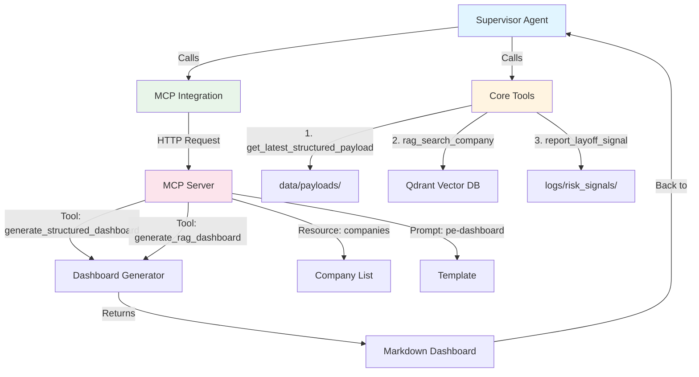

# Agent Architecture Diagram

## How Supervisor Agent, Tools, and MCP Work Together



## Simple Flow

```
┌─────────────────┐
│ Supervisor Agent│
│  (ReAct Loop)   │
└────────┬────────┘
         │
    ┌────┴────┐
    │         │
    ▼         ▼
┌────────┐ ┌──────────────┐
│ Tools  │ │ MCP Client   │
│        │ │ Integration  │
└───┬────┘ └──────┬───────┘
    │             │
    │             │ HTTP
    │             ▼
    │      ┌──────────────┐
    │      │  MCP Server   │
    │      │  (FastAPI)   │
    │      └──────┬───────┘
    │             │
    │             ▼
    │      ┌──────────────┐
    │      │  Dashboard   │
    │      │  Generator   │
    │      └──────────────┘
    │
    ▼
┌─────────────┐
│ Data Sources│
│ - Payloads  │
│ - Vector DB │
│ - Logs      │
└─────────────┘
```

## Step-by-Step Execution

### 1. Supervisor Agent Starts
```
Supervisor Agent
  ↓
  "I need to analyze anthropic"
```

### 2. Calls Core Tools
```
Supervisor Agent
  ↓
  Tool: get_latest_structured_payload("anthropic")
  ↓
  Returns: JSON payload from data/payloads/anthropic.json
```

### 3. Calls MCP Integration
```
Supervisor Agent
  ↓
  MCP Integration.call_tool("generate_structured_dashboard")
  ↓
  HTTP POST → http://localhost:8001/tool/generate_structured_dashboard
  ↓
  MCP Server processes request
  ↓
  Returns: Markdown dashboard
```

### 4. Complete Flow
```
Supervisor Agent
  ├─→ Tool 1: get_latest_structured_payload()
  │   └─→ Reads: data/payloads/{company}.json
  │
  ├─→ Tool 2: rag_search_company()
  │   └─→ Queries: Qdrant Vector DB
  │
  ├─→ Tool 3: report_layoff_signal()
  │   └─→ Writes: logs/risk_signals/{company}.json
  │
  └─→ MCP: generate_structured_dashboard()
      └─→ HTTP → MCP Server
          └─→ Dashboard Generator
              └─→ Returns: Markdown dashboard
```

## Component Details

### Supervisor Agent
- **Location:** `src/agents/supervisor_agent.py`
- **Pattern:** ReAct (Think → Act → Observe)
- **Calls:** Tools directly, MCP via integration

### Core Tools
- **Location:** `src/agents/tools.py`
- **Functions:**
  - `get_latest_structured_payload()` - Reads JSON files
  - `rag_search_company()` - Queries Qdrant
  - `report_layoff_signal()` - Logs risks

### MCP Integration
- **Location:** `src/agents/mcp_integration.py`
- **Purpose:** Client wrapper for MCP Server
- **Calls:** HTTP requests to MCP Server

### MCP Server
- **Location:** `src/server/mcp_server.py`
- **Type:** FastAPI HTTP server
- **Endpoints:**
  - `/tool/generate_structured_dashboard`
  - `/tool/generate_rag_dashboard`
  - `/resource/ai50/companies`
  - `/prompt/pe-dashboard`

## Data Flow

```
User Request
    ↓
Supervisor Agent.analyze_company("anthropic")
    ↓
Step 1: Think → "Get payload"
    ↓
Step 2: Act → get_latest_structured_payload()
    ↓
Step 3: Observe → "Retrieved payload: Founded 2020, $61.5B"
    ↓
Step 4: Think → "Generate dashboard"
    ↓
Step 5: Act → MCP.call_tool("generate_structured_dashboard")
    ↓
    HTTP POST → MCP Server
    ↓
    MCP Server → Dashboard Generator
    ↓
    Returns Markdown
    ↓
Step 6: Observe → "Dashboard generated (1,234 tokens)"
    ↓
Final: Save ReAct trace
    ↓
Return Analysis Report
```

