# ReAct Trace Example

This document demonstrates the structured ReAct (Reasoning + Acting) pattern logging used by the PE Due Diligence Supervisor Agent.

## Overview

The ReAct pattern logs agent reasoning in three phases:
1. **Thought** - Agent's internal reasoning about what to do next
2. **Action** - Tool/function call executed by the agent
3. **Observation** - Result or observation from the action

Each trace includes correlation IDs (`run_id`, `company_id`) for tracking and debugging.

## Example Trace

### Metadata

```json
{
  "run_id": "473a2a8d-bb93-4c83-b5fe-32192dac9578",
  "company_id": "anthropic",
  "start_time": "2025-11-14T23:34:49.123456",
  "end_time": "2025-11-14T23:34:52.789012",
  "duration_seconds": 3.67,
  "total_steps": 4
}
```

### Step-by-Step ReAct Sequence

#### Step 1: Retrieve Company Payload

**Thought:**
```
I need to analyze anthropic for PE due diligence. First, I should retrieve the company's structured payload to understand their business.
```

**Action:**
```json
{
  "name": "get_latest_structured_payload",
  "input": {
    "company_id": "anthropic"
  }
}
```

**Observation:**
```
✅ Retrieved payload for Anthropic. Founded: 2020, HQ: San Francisco, Valuation: $61,500,000,000
```

---

#### Step 2: Analyze Risks

**Thought:**
```
Now I have the company data. I should analyze it for potential risks like layoffs, funding issues, or leadership changes that would concern PE investors.
```

**Action:**
```
Risk analysis (internal logic)
```

**Observation:**
```
✅ Risk analysis complete. Found 4 potential risks:
   - High valuation risk (medium)
   - No hiring activity (medium)
   - Funding disclosure gaps (low)
   - Data completeness issues (low)
```

---

#### Step 3: Report Critical Risks

**Thought:**
```
Found critical risks that require human review. I should log these using the report_layoff_signal tool.
```

**Action:**
```json
{
  "name": "report_layoff_signal",
  "input": {
    "signal_type": "high_valuation",
    "severity": "medium"
  }
}
```

**Observation:**
```
✅ Risk signal logged successfully. Requires HITL review: false
```

---

#### Step 4: Generate Dashboard (Optional - via MCP)

**Thought:**
```
I can generate a structured dashboard via MCP to provide comprehensive analysis.
```

**Action:**
```json
{
  "name": "generate_structured_dashboard (MCP)",
  "input": {
    "company_id": "anthropic"
  }
}
```

**Observation:**
```
✅ Generated structured dashboard via MCP (1,234 tokens)
```

---

## Complete Trace Structure

```json
{
  "run_id": "473a2a8d-bb93-4c83-b5fe-32192dac9578",
  "company_id": "anthropic",
  "start_time": "2025-11-14T23:34:49.123456",
  "end_time": "2025-11-14T23:34:52.789012",
  "duration_seconds": 3.67,
  "total_steps": 4,
  "steps": [
    {
      "step_number": 1,
      "run_id": "473a2a8d-bb93-4c83-b5fe-32192dac9578",
      "company_id": "anthropic",
      "timestamp": "2025-11-14T23:34:49.234567",
      "thought": "I need to analyze anthropic for PE due diligence...",
      "action": {
        "name": "get_latest_structured_payload",
        "input": {
          "company_id": "anthropic"
        }
      },
      "observation": {
        "success": true,
        "content": "Retrieved payload for Anthropic..."
      }
    },
    {
      "step_number": 2,
      "run_id": "473a2a8d-bb93-4c83-b5fe-32192dac9578",
      "company_id": "anthropic",
      "timestamp": "2025-11-14T23:34:50.345678",
      "thought": "Now I have the company data. I should analyze it for risks...",
      "action": {
        "name": "risk_analysis",
        "input": {}
      },
      "observation": {
        "success": true,
        "content": "Risk analysis complete. Found 4 potential risks."
      }
    },
    {
      "step_number": 3,
      "run_id": "473a2a8d-bb93-4c83-b5fe-32192dac9578",
      "company_id": "anthropic",
      "timestamp": "2025-11-14T23:34:51.456789",
      "thought": "Found critical risks that require human review...",
      "action": {
        "name": "report_layoff_signal",
        "input": {
          "signal_type": "high_valuation",
          "severity": "medium"
        }
      },
      "observation": {
        "success": true,
        "content": "Risk signal logged successfully."
      }
    },
    {
      "step_number": 4,
      "run_id": "473a2a8d-bb93-4c83-b5fe-32192dac9578",
      "company_id": "anthropic",
      "timestamp": "2025-11-14T23:34:52.567890",
      "thought": "I can generate a structured dashboard via MCP...",
      "action": {
        "name": "generate_structured_dashboard (MCP)",
        "input": {
          "company_id": "anthropic"
        }
      },
      "observation": {
        "success": true,
        "content": "Generated structured dashboard via MCP (1,234 tokens)"
      }
    }
  ],
  "final_output": "PE DUE DILIGENCE ANALYSIS - INVESTOR BRIEF\n\nCOMPANY: Anthropic\n...",
  "metadata": {
    "total_thoughts": 4,
    "total_actions": 4,
    "total_observations": 4,
    "successful_observations": 4
  }
}
```

## Trace File Location

Traces are saved to: `logs/react_traces/react_trace_{company_id}_{timestamp}.json`

Example: `logs/react_traces/react_trace_anthropic_20251114_233449.json`

## Correlation IDs

- **`run_id`**: Unique identifier for each agent execution (UUID)
- **`company_id`**: Company being analyzed (e.g., "anthropic", "databricks")
- **`step_number`**: Sequential step number within the trace
- **`timestamp`**: ISO 8601 timestamp for each step

## Usage

To view traces:

```bash
# List all traces
ls logs/react_traces/

# View a specific trace
cat logs/react_traces/react_trace_anthropic_20251114_233449.json | jq

# Filter by company
grep -l "anthropic" logs/react_traces/*.json

# Filter by run_id
grep -l "473a2a8d-bb93-4c83-b5fe-32192dac9578" logs/react_traces/*.json
```

## Lab 18: Decision Path and Execution Visualization

### Execution Path Tracking

The workflow tracks the complete execution path through all nodes:

```json
{
  "execution_path": [
    {
      "node": "planner",
      "start_time": "2025-11-15T01:00:00.000000",
      "end_time": "2025-11-15T01:00:00.100000",
      "status": "completed"
    },
    {
      "node": "data_generator",
      "start_time": "2025-11-15T01:00:00.100000",
      "end_time": "2025-11-15T01:00:05.500000",
      "status": "completed"
    },
    {
      "node": "evaluator",
      "start_time": "2025-11-15T01:00:05.500000",
      "end_time": "2025-11-15T01:00:05.800000",
      "status": "completed",
      "score": 75.4
    },
    {
      "node": "risk_detector",
      "start_time": "2025-11-15T01:00:05.800000",
      "end_time": "2025-11-15T01:00:05.900000",
      "status": "completed",
      "risks_found": 4,
      "branch": "hitl"
    },
    {
      "node": "hitl",
      "start_time": "2025-11-15T01:00:05.900000",
      "end_time": "2025-11-15T01:00:15.200000",
      "status": "completed",
      "decision": "approved",
      "approved": true
    }
  ]
}
```

### Decision Path

**Branch Taken:** `hitl`

**HITL Review:**
- **Decision:** approved
- **Approved:** true
- **Risk Keywords:** layoff, layoffs, security incident, leadership change
- **Dashboard Score:** 75.4/100
- **Human Review Duration:** ~9.3 seconds

### Mermaid Visualization

The execution path is visualized using Mermaid diagrams:

```mermaid
graph TD
    planner["planner
    ✅ completed"]
    data_generator["data_generator
    ✅ completed"]
    evaluator["evaluator
    ✅ completed
    Score: 75.4"]
    risk_detector["risk_detector
    ✅ completed
    Risks: 4"]
    hitl["hitl
    ✅ completed
    Decision: approved"]
    
    planner --> data_generator
    data_generator --> evaluator
    evaluator --> risk_detector
    risk_detector -->|"Risks detected"| hitl
    
    style planner fill:#e1f5ff
    style data_generator fill:#fff4e1
    style evaluator fill:#e8f5e9
    style risk_detector fill:#fff3e0
    style hitl fill:#fce4ec
```



### HITL CLI Pause

When risks are detected, the workflow pauses and waits for human input:

```
======================================================================
👤 HITL NODE: anthropic
======================================================================
   ⏸️  Workflow paused for human review

   📊 Risk Summary:
      Risk keywords: layoff, layoffs, security incident, leadership change
      Dashboard score: 75.4/100
      Company: anthropic

   ──────────────────────────────────────────────────────────────────
   ⚠️  HUMAN REVIEW REQUIRED
   ──────────────────────────────────────────────────────────────────
   This workflow has detected risks that require human review.
   Please review the information above and decide:

   Options:
     [y] Approve - Continue workflow
     [n] Reject - Stop workflow
     [s] Skip HITL - Continue without approval (not recommended)

   ──────────────────────────────────────────────────────────────────

   Enter your decision (y/n/s): y

   ✅ Human approved - continuing workflow
```

**Options:**
- `y` or `yes` - Approve and continue workflow
- `n` or `no` - Reject and stop workflow
- `s` or `skip` - Skip HITL (not recommended)

### Execution Trace Files

Execution traces are saved to `docs/execution_trace_{company_id}_{timestamp}.md` with:
- Complete execution path
- Decision path
- Mermaid visualization
- Complete workflow state

## Checkpoint Validation

✅ **JSON logs show sequential ReAct steps** - Each trace contains ordered steps with thought/action/observation triplets

✅ **Correlation IDs present** - Every log entry includes `run_id` and `company_id`

✅ **Structured format** - All traces saved as valid JSON with consistent schema

✅ **Trace file saved** - Example trace documented in `docs/REACT_TRACE_EXAMPLE.md`

✅ **Lab 18: CLI pause implemented** - Workflow pauses and waits for human approval

✅ **Lab 18: Execution path tracked** - Complete node execution path with timestamps

✅ **Lab 18: Mermaid visualization** - Execution path visualized in trace files

✅ **Lab 18: Decision path documented** - HITL decisions and branch taken recorded

