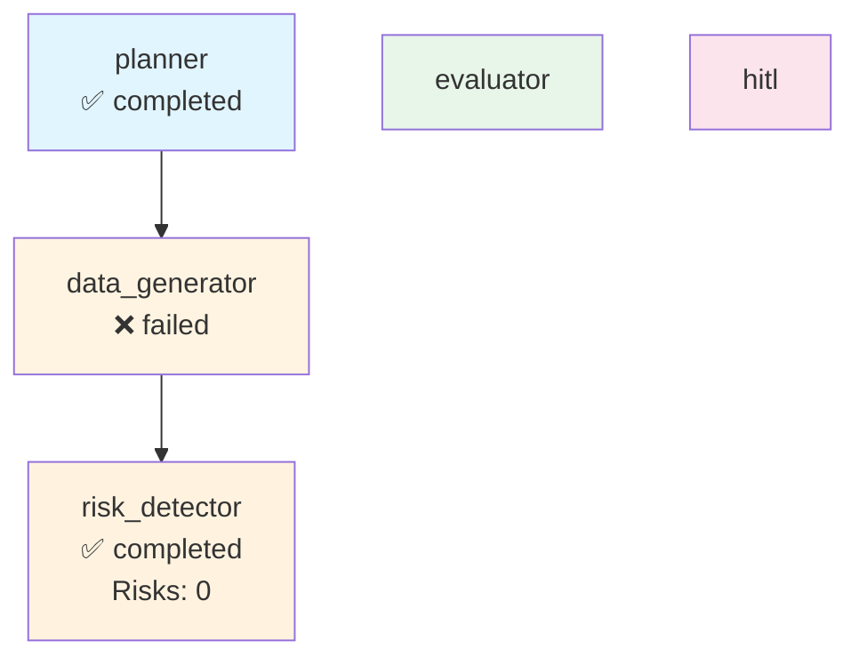

# Execution Trace - abridge

**Run ID:** 726e1c30-e0b5-41c3-90ba-465bdf29f3ec  
**Company:** abridge  
**Branch Taken:** normal  
**Timestamp:** 2025-11-19T16:42:59.299664

## Execution Path

### Nodes Executed

### 1. Planner

- **Status:** completed
- **Start Time:** 2025-11-19T16:42:55.238096
- **End Time:** 2025-11-19T16:42:55.239755

### 2. Data Generator

- **Status:** failed
- **Start Time:** 2025-11-19T16:42:55.242170
- **End Time:** 2025-11-19T16:42:59.290099

### 3. Risk Detector

- **Status:** completed
- **Start Time:** 2025-11-19T16:42:59.295509
- **End Time:** 2025-11-19T16:42:59.296977
- **Risks Found:** 0
- **Branch:** normal


## Decision Path

**Branch Taken:** `normal`


### Normal Flow

No risks detected. Workflow completed without HITL intervention.


## Visualization



## Complete State

```json
{
  "company_id": "abridge",
  "plan": [
    "1. Retrieve company structured payload",
    "2. Generate dashboard via MCP",
    "3. Evaluate dashboard quality",
    "4. Detect risks and determine if HITL needed"
  ],
  "payload": {
    "company_record": {
      "company_id": "abridge",
      "legal_name": "",
      "brand_name": null,
      "website": "https://abridge.com",
      "hq_city": "Pittsburgh",
      "hq_state": null,
      "hq_country": "United States",
      "founded_year": 2018,
      "categories": [],
      "related_companies": [],
      "total_raised_usd": null,
      "last_disclosed_valuation_usd": null,
      "last_round_name": null,
      "last_round_date": null,
      "schema_version": "2.0.0",
      "as_of": "2025-11-17",
      "provenance": [
        {
          "source_url": "https://abridge.com",
          "crawled_at": "2025-11-17T23:25:17.579194",
          "source_folder": "2025-11-17_daily",
          "data_files_used": [
            "blog",
            "careers"
          ],
          "snippet": "Extracted from 2025-11-17_daily data"
        }
      ]
    },
    "events": [],
    "snapshots": [
      {
        "company_id": "abridge",
        "as_of": "2025-11-17",
        "headcount_total": null,
        "job_openings_count": 0,
        "engineering_openings": null,
        "sales_openings": null,
        "hiring_focus": [],
        "pricing_tiers": [
          "Professional",
          "Team",
          "Business",
          "Enterprise",
          "Scale"
        ],
        "active_products": [],
        "geo_presence": [],
        "confidence": null,
        "schema_version": "2.0.0",
        "provenance": []
      }
    ],
    "products": [],
    "leadership": [
      {
        "person_id": "person_abridge_ceo",
        "company_id": "abridge",
        "name": "Shiv Rao",
        "role": "CEO",
        "is_founder": true,
        "previous_affiliation": null,
        "education": null,
        "linkedin": null,
        "schema_version": "2.0.0",
        "provenance": []
      }
    ],
    "visibility": [
      {
        "company_id": "abridge",
        "as_of": "2025-11-17",
        "news_mentions_30d": null,
        "github_stars": null,
        "schema_version": "2.0.0",
        "provenance": []
      }
    ],
    "notes": "Extracted 2025-11-17",
    "provenance_policy": "Use only scraped sources. If missing: 'Not disclosed.'"
  },
  "dashboard_markdown": null,
  "dashboard_score": 0.0,
  "risk_keywords": [],
  "requires_hitl": false,
  "branch_taken": "normal",
  "error": "No dashboard to evaluate",
  "execution_path": [
    {
      "node": "planner",
      "start_time": "2025-11-19T16:42:55.238096",
      "end_time": "2025-11-19T16:42:55.239755",
      "status": "completed"
    },
    {
      "node": "data_generator",
      "start_time": "2025-11-19T16:42:55.242170",
      "end_time": "2025-11-19T16:42:59.290099",
      "status": "failed"
    },
    {
      "node": "risk_detector",
      "start_time": "2025-11-19T16:42:59.295509",
      "end_time": "2025-11-19T16:42:59.296977",
      "status": "completed",
      "risks_found": 0,
      "branch": "normal"
    }
  ],
  "metadata": {
    "run_id": "726e1c30-e0b5-41c3-90ba-465bdf29f3ec",
    "planner_timestamp": "2025-11-19T16:42:55.238096",
    "risk_detection_timestamp": "2025-11-19T16:42:59.296966",
    "risk_count": 0
  }
}
```
