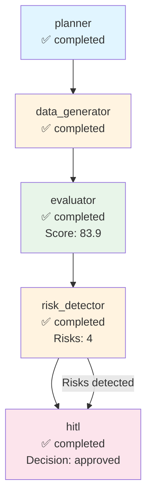

# Execution Trace - abridge

**Run ID:** 013b0e52-406e-43f4-aea8-b19c1922d956  
**Company:** abridge  
**Branch Taken:** hitl  
**Timestamp:** 2025-11-19T16:46:02.561319

## Execution Path

### Nodes Executed

### 1. Planner

- **Status:** completed
- **Start Time:** 2025-11-19T16:45:50.345106
- **End Time:** 2025-11-19T16:45:50.345623

### 2. Data Generator

- **Status:** completed
- **Start Time:** 2025-11-19T16:45:50.348142
- **End Time:** 2025-11-19T16:46:02.545956

### 3. Evaluator

- **Status:** completed
- **Start Time:** 2025-11-19T16:46:02.547852
- **End Time:** 2025-11-19T16:46:02.549532
- **Dashboard Score:** 83.9/100

### 4. Risk Detector

- **Status:** completed
- **Start Time:** 2025-11-19T16:46:02.551357
- **End Time:** 2025-11-19T16:46:02.553600
- **Risks Found:** 4
- **Branch:** hitl

### 5. Hitl

- **Status:** completed
- **Start Time:** 2025-11-19T16:46:02.557072
- **End Time:** 2025-11-19T16:46:02.559742
- **HITL Decision:** approved
- **Approved:** True


## Decision Path

**Branch Taken:** `hitl`


### HITL Review

- **Decision:** approved
- **Approved:** True
- **Risk Keywords:** layoff, layoffs, security incident, leadership change
- **Dashboard Score:** 83.9/100


## Visualization



## Complete State

```json
{
  "company_id": "abridge",
  "plan": [
    "1. Retrieve company structured payload",
    "2. Generate dashboard via MCP",
    "3. Evaluate dashboard quality",
    "4. Detect risks and determine if HITL needed"
  ],
  "payload": {
    "company_record": {
      "company_id": "abridge",
      "legal_name": "",
      "brand_name": null,
      "website": "https://abridge.com",
      "hq_city": "Pittsburgh",
      "hq_state": null,
      "hq_country": "United States",
      "founded_year": 2018,
      "categories": [],
      "related_companies": [],
      "total_raised_usd": null,
      "last_disclosed_valuation_usd": null,
      "last_round_name": null,
      "last_round_date": null,
      "schema_version": "2.0.0",
      "as_of": "2025-11-17",
      "provenance": [
        {
          "source_url": "https://abridge.com",
          "crawled_at": "2025-11-17T23:25:17.579194",
          "source_folder": "2025-11-17_daily",
          "data_files_used": [
            "blog",
            "careers"
          ],
          "snippet": "Extracted from 2025-11-17_daily data"
        }
      ]
    },
    "events": [],
    "snapshots": [
      {
        "company_id": "abridge",
        "as_of": "2025-11-17",
        "headcount_total": null,
        "job_openings_count": 0,
        "engineering_openings": null,
        "sales_openings": null,
        "hiring_focus": [],
        "pricing_tiers": [
          "Professional",
          "Team",
          "Business",
          "Enterprise",
          "Scale"
        ],
        "active_products": [],
        "geo_presence": [],
        "confidence": null,
        "schema_version": "2.0.0",
        "provenance": []
      }
    ],
    "products": [],
    "leadership": [
      {
        "person_id": "person_abridge_ceo",
        "company_id": "abridge",
        "name": "Shiv Rao",
        "role": "CEO",
        "is_founder": true,
        "previous_affiliation": null,
        "education": null,
        "linkedin": null,
        "schema_version": "2.0.0",
        "provenance": []
      }
    ],
    "visibility": [
      {
        "company_id": "abridge",
        "as_of": "2025-11-17",
        "news_mentions_30d": null,
        "github_stars": null,
        "schema_version": "2.0.0",
        "provenance": []
      }
    ],
    "notes": "Extracted 2025-11-17",
    "provenance_policy": "Use only scraped sources. If missing: 'Not disclosed.'"
  },
  "dashboard_markdown": "## Company Overview\n**Legal Name:** Not disclosed.  \n**Brand Name:** Not disclosed.  \n**Headquarters:** Pittsburgh, United States  \n**Founded:** 2018  \n**Categories:** Not disclosed.  \n**Competitive Positioning:** Not disclosed.\n\n## Business Model and GTM\nAbridge sells to unspecified customers and offers multiple pricing tiers: Professional, Team, Business, Enterprise, and Scale. Integration partners and reference customers are not disclosed.\n\n## Funding & Investor Profile\nNo funding history is available as there are no recorded events related to funding. The total amount raised, last round name, and last disclosed valuation are all not disclosed.\n\n## Growth Momentum\nAs of the latest snapshot on November 17, 2025, the total headcount is not disclosed, and there are currently no job openings. There are no engineering or sales openings reported. No major events such as partnerships, product releases, or leadership changes have been recorded.\n\n## Visibility & Market Sentiment\nVisibility metrics indicate that news mentions in the last 30 days and GitHub stars are not disclosed. Therefore, the current attention level is unclear.\n\n## Risks and Challenges\nNo specific risks or challenges are identified from the available data, as there are no reports of layoffs, regulatory/security incidents, executive churn, pricing pressure, or GTM concentration risk.\n\n## Outlook\nThe company is led by founder and CEO Shiv Rao, which may provide a data advantage and a strong vision for the future. However, with no disclosed hiring momentum and no active products or partnerships, scaling the go-to-market strategy remains uncertain. The macro fit is also unclear due to the lack of disclosed market presence and customer engagement.\n\n## Disclosure Gaps\n- \"Valuation not disclosed.\"\n- \"Total amount raised not disclosed.\"\n- \"Headcount growth not confirmed.\"\n- \"No public sentiment data.\"\n- \"No active products or partnerships disclosed.\"",
  "dashboard_score": 83.92857142857143,
  "risk_keywords": [
    "layoff",
    "layoffs",
    "security incident",
    "leadership change"
  ],
  "requires_hitl": true,
  "branch_taken": "hitl",
  "error": null,
  "execution_path": [
    {
      "node": "planner",
      "start_time": "2025-11-19T16:45:50.345106",
      "end_time": "2025-11-19T16:45:50.345623",
      "status": "completed"
    },
    {
      "node": "data_generator",
      "start_time": "2025-11-19T16:45:50.348142",
      "end_time": "2025-11-19T16:46:02.545956",
      "status": "completed"
    },
    {
      "node": "evaluator",
      "start_time": "2025-11-19T16:46:02.547852",
      "end_time": "2025-11-19T16:46:02.549532",
      "status": "completed",
      "score": 83.92857142857143
    },
    {
      "node": "risk_detector",
      "start_time": "2025-11-19T16:46:02.551357",
      "end_time": "2025-11-19T16:46:02.553600",
      "status": "completed",
      "risks_found": 4,
      "branch": "hitl"
    },
    {
      "node": "hitl",
      "start_time": "2025-11-19T16:46:02.557072",
      "end_time": "2025-11-19T16:46:02.559742",
      "status": "completed",
      "decision": "approved",
      "approved": true
    }
  ],
  "metadata": {
    "run_id": "013b0e52-406e-43f4-aea8-b19c1922d956",
    "planner_timestamp": "2025-11-19T16:45:50.345106",
    "tokens_used": 1583,
    "evaluation_timestamp": "2025-11-19T16:46:02.549268",
    "risk_detection_timestamp": "2025-11-19T16:46:02.553583",
    "risk_count": 4,
    "hitl_approved": true,
    "hitl_decision": "approved",
    "hitl_timestamp": "2025-11-19T16:46:02.557072",
    "hitl_decision_timestamp": "2025-11-19T16:46:02.559736"
  }
}
```
