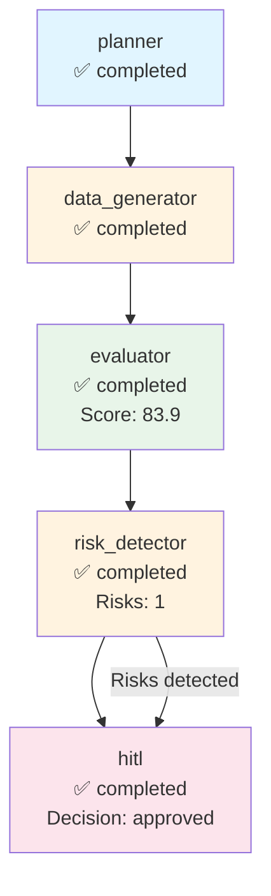

# Execution Trace - anthropic

**Run ID:** 3b1d2d82-fcbb-45b3-9ea1-18c05b97e146  
**Company:** anthropic  
**Branch Taken:** hitl  
**Timestamp:** 2025-11-17T14:31:52.485552

## Execution Path

### Nodes Executed

### 1. Planner

- **Status:** completed
- **Start Time:** 2025-11-17T14:30:17.670009
- **End Time:** 2025-11-17T14:30:17.671010

### 2. Data Generator

- **Status:** completed
- **Start Time:** 2025-11-17T14:30:17.671010
- **End Time:** 2025-11-17T14:30:32.975750

### 3. Evaluator

- **Status:** completed
- **Start Time:** 2025-11-17T14:30:32.977783
- **End Time:** 2025-11-17T14:30:32.981123
- **Dashboard Score:** 83.9/100

### 4. Risk Detector

- **Status:** completed
- **Start Time:** 2025-11-17T14:30:32.983124
- **End Time:** 2025-11-17T14:30:32.986122
- **Risks Found:** 1
- **Branch:** hitl

### 5. Hitl

- **Status:** completed
- **Start Time:** 2025-11-17T14:30:32.989644
- **End Time:** 2025-11-17T14:31:52.484045
- **HITL Decision:** approved
- **Approved:** True


## Decision Path

**Branch Taken:** `hitl`


### HITL Review

- **Decision:** approved
- **Approved:** True
- **Risk Keywords:** leadership change
- **Dashboard Score:** 83.9/100


## Visualization



## Complete State

```json
{
  "company_id": "anthropic",
  "plan": [
    "1. Retrieve company structured payload",
    "2. Generate dashboard via MCP",
    "3. Evaluate dashboard quality",
    "4. Detect risks and determine if HITL needed"
  ],
  "payload": {
    "company_record": {
      "company_id": "anthropic",
      "legal_name": "Anthropic",
      "brand_name": null,
      "website": "https://www.anthropic.com",
      "hq_city": "San Francisco",
      "hq_state": null,
      "hq_country": "United States",
      "founded_year": 2020,
      "categories": [],
      "related_companies": [],
      "total_raised_usd": null,
      "last_disclosed_valuation_usd": 61500000000.0,
      "last_round_name": null,
      "last_round_date": null,
      "schema_version": "2.0.0",
      "as_of": "2025-11-05",
      "provenance": [
        {
          "source_url": "https://www.anthropic.com",
          "crawled_at": "2025-11-05T19:28:28.317234",
          "snippet": "Extracted from scraped pages"
        }
      ]
    },
    "events": [],
    "snapshots": [
      {
        "company_id": "anthropic",
        "as_of": "2025-11-05",
        "headcount_total": null,
        "job_openings_count": 0,
        "engineering_openings": null,
        "sales_openings": null,
        "hiring_focus": [],
        "pricing_tiers": [
          "Free",
          "Basic",
          "Plus",
          "Pro",
          "Premium",
          "Team"
        ],
        "active_products": [],
        "geo_presence": [],
        "confidence": null,
        "schema_version": "2.0.0",
        "provenance": []
      }
    ],
    "products": [],
    "leadership": [
      {
        "person_id": "person_anthropic_ceo",
        "company_id": "anthropic",
        "name": "Dario Amodei",
        "role": "CEO",
        "is_founder": true,
        "previous_affiliation": null,
        "education": null,
        "linkedin": null,
        "schema_version": "2.0.0",
        "provenance": []
      }
    ],
    "visibility": [
      {
        "company_id": "anthropic",
        "as_of": "2025-11-05",
        "news_mentions_30d": null,
        "github_stars": null,
        "schema_version": "2.0.0",
        "provenance": []
      }
    ],
    "notes": "Extracted 2025-11-05",
    "provenance_policy": "Use only scraped sources. If missing: 'Not disclosed.'"
  },
  "dashboard_markdown": "## Company Overview\n**Legal Name:** Anthropic  \n**Headquarters:** San Francisco, United States  \n**Founded Year:** 2020  \n**Categories:** Not disclosed.  \n**Competitive Positioning:** Not disclosed.\n\n## Business Model and GTM\nAnthropic sells to unspecified customers and offers a variety of pricing tiers including Free, Basic, Plus, Pro, Premium, and Team. Integration partners and reference customers are not disclosed.\n\n## Funding & Investor Profile\nThe total amount raised is not disclosed. The last disclosed valuation is $61.5 billion. There are no funding events recorded in the provided data.\n\n## Growth Momentum\nAs of November 5, 2025, the company has a total headcount that is not disclosed and currently has 0 job openings. There are no engineering or sales openings reported. No major events such as partnerships, product releases, or leadership changes are recorded.\n\n## Visibility & Market Sentiment\nThe visibility metrics indicate that there are no news mentions in the last 30 days and GitHub stars are not disclosed. Therefore, the attention is unclear.\n\n## Risks and Challenges\nNo downside signals are reported in the data provided.\n\n## Outlook\nAnthropic is led by CEO Dario Amodei, a founder with a notable pedigree in the AI space. However, with no current job openings, the company's growth trajectory and go-to-market strategy may need to be assessed further. The lack of disclosed visibility metrics and funding history may also present challenges in understanding market sentiment and investor confidence.\n\n## Disclosure Gaps\n- \"Valuation not disclosed.\"\n- \"Headcount growth not confirmed.\"\n- \"No public sentiment data.\"",
  "dashboard_score": 83.92857142857143,
  "risk_keywords": [
    "leadership change"
  ],
  "requires_hitl": true,
  "branch_taken": "hitl",
  "error": null,
  "execution_path": [
    {
      "node": "planner",
      "start_time": "2025-11-17T14:30:17.670009",
      "end_time": "2025-11-17T14:30:17.671010",
      "status": "completed"
    },
    {
      "node": "data_generator",
      "start_time": "2025-11-17T14:30:17.671010",
      "end_time": "2025-11-17T14:30:32.975750",
      "status": "completed"
    },
    {
      "node": "evaluator",
      "start_time": "2025-11-17T14:30:32.977783",
      "end_time": "2025-11-17T14:30:32.981123",
      "status": "completed",
      "score": 83.92857142857143
    },
    {
      "node": "risk_detector",
      "start_time": "2025-11-17T14:30:32.983124",
      "end_time": "2025-11-17T14:30:32.986122",
      "status": "completed",
      "risks_found": 1,
      "branch": "hitl"
    },
    {
      "node": "hitl",
      "start_time": "2025-11-17T14:30:32.989644",
      "end_time": "2025-11-17T14:31:52.484045",
      "status": "completed",
      "decision": "approved",
      "approved": true
    }
  ],
  "metadata": {
    "run_id": "3b1d2d82-fcbb-45b3-9ea1-18c05b97e146",
    "planner_timestamp": "2025-11-17T14:30:17.670009",
    "tokens_used": 1515,
    "evaluation_timestamp": "2025-11-17T14:30:32.980121",
    "risk_detection_timestamp": "2025-11-17T14:30:32.986122",
    "risk_count": 1,
    "hitl_approved": true,
    "hitl_decision": "approved",
    "hitl_timestamp": "2025-11-17T14:30:32.989644",
    "hitl_decision_timestamp": "2025-11-17T14:31:52.484045"
  }
}
```
