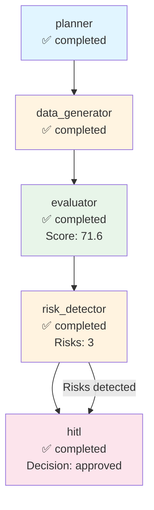

# Execution Trace - anthropic

**Run ID:** 9fde3e54-8cc4-430d-8c4e-7000f77414f8  
**Company:** anthropic  
**Branch Taken:** hitl  
**Timestamp:** 2025-11-18T00:12:15.926790

## Execution Path

### Nodes Executed

### 1. Planner

- **Status:** completed
- **Start Time:** 2025-11-18T00:11:49.001054
- **End Time:** 2025-11-18T00:11:49.001726

### 2. Data Generator

- **Status:** completed
- **Start Time:** 2025-11-18T00:11:49.002457
- **End Time:** 2025-11-18T00:11:57.747962

### 3. Evaluator

- **Status:** completed
- **Start Time:** 2025-11-18T00:11:57.748695
- **End Time:** 2025-11-18T00:11:57.749277
- **Dashboard Score:** 71.6/100

### 4. Risk Detector

- **Status:** completed
- **Start Time:** 2025-11-18T00:11:57.749859
- **End Time:** 2025-11-18T00:11:57.750607
- **Risks Found:** 3
- **Branch:** hitl

### 5. Hitl

- **Status:** completed
- **Start Time:** 2025-11-18T00:11:57.751448
- **End Time:** 2025-11-18T00:12:15.925443
- **HITL Decision:** approved
- **Approved:** True


## Decision Path

**Branch Taken:** `hitl`


### HITL Review

- **Decision:** approved
- **Approved:** True
- **Risk Keywords:** layoff, layoffs, security incident
- **Dashboard Score:** 71.6/100


## Visualization



## Complete State

```json
{
  "company_id": "anthropic",
  "plan": [
    "1. Retrieve company structured payload",
    "2. Generate dashboard via MCP",
    "3. Evaluate dashboard quality",
    "4. Detect risks and determine if HITL needed"
  ],
  "payload": {
    "company_record": {
      "company_id": "anthropic",
      "legal_name": "Anthropic",
      "brand_name": null,
      "website": "Not available",
      "hq_city": "San Francisco",
      "hq_state": "California",
      "hq_country": "United States",
      "founded_year": 2021,
      "categories": [
        "Artificial Intelligence",
        "Machine Learning"
      ],
      "related_companies": [],
      "total_raised_usd": 580000000.0,
      "last_disclosed_valuation_usd": 5000000000.0,
      "last_round_name": "Series C",
      "last_round_date": "2022-12-15",
      "schema_version": "2.0.0",
      "as_of": "2025-11-17",
      "provenance": [
        {
          "source_url": "Not available",
          "crawled_at": "2025-11-17T23:25:27.194073",
          "source_folder": "2025-11-12_daily",
          "data_files_used": [
            "blog",
            "careers",
            "news"
          ],
          "snippet": "Extracted from 2025-11-12_daily data"
        }
      ]
    },
    "events": [],
    "snapshots": [
      {
        "company_id": "anthropic",
        "as_of": "2025-11-17",
        "headcount_total": null,
        "job_openings_count": 0,
        "engineering_openings": null,
        "sales_openings": null,
        "hiring_focus": [],
        "pricing_tiers": [],
        "active_products": [],
        "geo_presence": [],
        "confidence": null,
        "schema_version": "2.0.0",
        "provenance": []
      }
    ],
    "products": [],
    "leadership": [],
    "visibility": [
      {
        "company_id": "anthropic",
        "as_of": "2025-11-17",
        "news_mentions_30d": null,
        "github_stars": null,
        "schema_version": "2.0.0",
        "provenance": []
      }
    ],
    "notes": "Extracted 2025-11-17",
    "provenance_policy": "Use only scraped sources. If missing: 'Not disclosed.'"
  },
  "dashboard_markdown": "## Company Overview\n**Legal Name:** Anthropic  \n**HQ:** San Francisco, California, United States  \n**Founded Year:** 2021  \n**Categories:** Artificial Intelligence, Machine Learning  \n**Competitive Positioning:** Not disclosed.\n\n## Business Model and GTM\nThe company sells to unspecified customers. Pricing model and tiers are not disclosed. There are no known integration partners or reference customers publicly named.\n\n## Funding & Investor Profile\nAnthropic has raised a total of $580 million. The last funding round was a Series C on December 15, 2022, with a disclosed valuation of $5 billion.\n\n## Growth Momentum\nAs of the latest snapshot on November 17, 2025, the total headcount is not disclosed, and there are currently no job openings. There are no active products or major events reported.\n\n## Visibility & Market Sentiment\nVisibility metrics indicate that news mentions in the last 30 days and GitHub stars are not disclosed. Therefore, the attention on the company is unclear.\n\n## Risks and Challenges\nThere are no reported risks or challenges, such as layoffs, regulatory/security incidents, executive churn, pricing pressure, or GTM concentration risk.\n\n## Outlook\nThe company's moat, potential for data advantage, and integrations remain unclear due to a lack of disclosed information. The absence of job openings may suggest a pause in scaling efforts. Overall macro fit is not assessable based on available data.\n\n## Disclosure Gaps\n- \"Valuation not disclosed.\"\n- \"Headcount growth not confirmed.\"\n- \"No public sentiment data.\"\n- \"No information on products or leadership.\"",
  "dashboard_score": 71.60714285714286,
  "risk_keywords": [
    "layoff",
    "layoffs",
    "security incident"
  ],
  "requires_hitl": true,
  "branch_taken": "hitl",
  "error": null,
  "execution_path": [
    {
      "node": "planner",
      "start_time": "2025-11-18T00:11:49.001054",
      "end_time": "2025-11-18T00:11:49.001726",
      "status": "completed"
    },
    {
      "node": "data_generator",
      "start_time": "2025-11-18T00:11:49.002457",
      "end_time": "2025-11-18T00:11:57.747962",
      "status": "completed"
    },
    {
      "node": "evaluator",
      "start_time": "2025-11-18T00:11:57.748695",
      "end_time": "2025-11-18T00:11:57.749277",
      "status": "completed",
      "score": 71.60714285714286
    },
    {
      "node": "risk_detector",
      "start_time": "2025-11-18T00:11:57.749859",
      "end_time": "2025-11-18T00:11:57.750607",
      "status": "completed",
      "risks_found": 3,
      "branch": "hitl"
    },
    {
      "node": "hitl",
      "start_time": "2025-11-18T00:11:57.751448",
      "end_time": "2025-11-18T00:12:15.925443",
      "status": "completed",
      "decision": "approved",
      "approved": true
    }
  ],
  "metadata": {
    "run_id": "9fde3e54-8cc4-430d-8c4e-7000f77414f8",
    "planner_timestamp": "2025-11-18T00:11:49.001054",
    "tokens_used": 1446,
    "evaluation_timestamp": "2025-11-18T00:11:57.749194",
    "risk_detection_timestamp": "2025-11-18T00:11:57.750601",
    "risk_count": 3,
    "hitl_approved": true,
    "hitl_decision": "approved",
    "hitl_timestamp": "2025-11-18T00:11:57.751448",
    "hitl_decision_timestamp": "2025-11-18T00:12:15.925434"
  }
}
```
