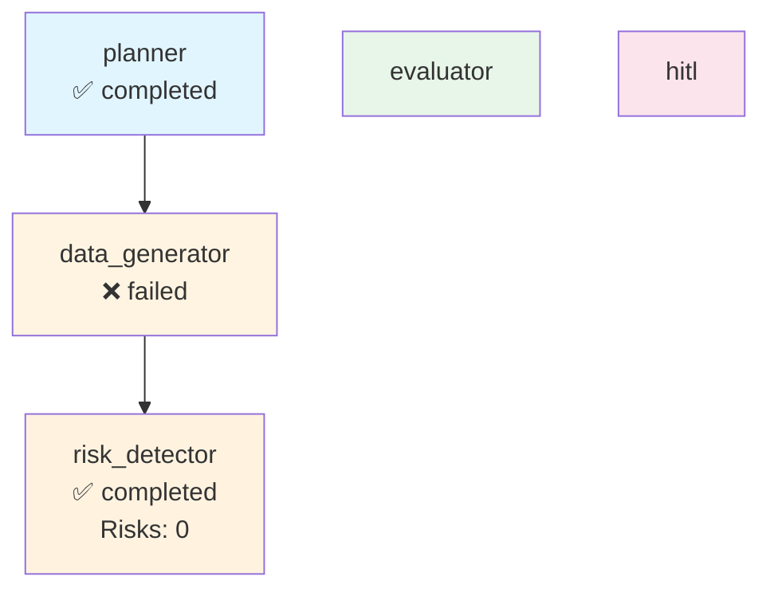

# Execution Trace - anthropic

**Run ID:** 3ae99fda-c115-4299-b6a9-d401b651df40  
**Company:** anthropic  
**Branch Taken:** normal  
**Timestamp:** 2025-11-20T14:55:02.848600

## Execution Path

### Nodes Executed

### 1. Planner

- **Status:** completed
- **Start Time:** 2025-11-20T14:55:02.778079
- **End Time:** 2025-11-20T14:55:02.782839

### 2. Data Generator

- **Status:** failed
- **Start Time:** 2025-11-20T14:55:02.785098
- **End Time:** 2025-11-20T14:55:02.831821

### 3. Risk Detector

- **Status:** completed
- **Start Time:** 2025-11-20T14:55:02.842029
- **End Time:** 2025-11-20T14:55:02.843946
- **Risks Found:** 0
- **Branch:** normal


## Decision Path

**Branch Taken:** `normal`


### Normal Flow

No risks detected. Workflow completed without HITL intervention.


## Visualization



## Complete State

```json
{
  "company_id": "anthropic",
  "plan": [
    "1. Retrieve company structured payload",
    "2. Generate dashboard via MCP",
    "3. Evaluate dashboard quality",
    "4. Detect risks and determine if HITL needed"
  ],
  "payload": {
    "company_record": {
      "company_id": "anthropic",
      "legal_name": "Anthropic",
      "brand_name": null,
      "website": "Not available",
      "hq_city": "San Francisco",
      "hq_state": "California",
      "hq_country": "United States",
      "founded_year": 2021,
      "categories": [
        "Artificial Intelligence",
        "Research",
        "Safety"
      ],
      "related_companies": [
        "Rwandan Government",
        "Cognizant",
        "Salesforce",
        "Deloitte",
        "NASA"
      ],
      "total_raised_usd": 13000000000.0,
      "last_disclosed_valuation_usd": 183000000000.0,
      "last_round_name": "Series F",
      "last_round_date": "2025-09-02",
      "schema_version": "2.0.0",
      "as_of": "2025-11-19",
      "provenance": [
        {
          "source_url": "Not available",
          "crawled_at": "2025-11-19T22:40:15.777384",
          "source_folder": "local",
          "data_files_used": [],
          "snippet": "Extracted from scraped data"
        }
      ]
    },
    "events": [],
    "snapshots": [
      {
        "company_id": "anthropic",
        "as_of": "2025-11-19",
        "headcount_total": null,
        "job_openings_count": 0,
        "engineering_openings": 0,
        "sales_openings": 0,
        "hiring_focus": [],
        "pricing_tiers": [
          "Free",
          "Pro",
          "Team",
          "Enterprise",
          "Education plan"
        ],
        "active_products": [
          "Claude"
        ],
        "geo_presence": [],
        "confidence": null,
        "schema_version": "2.0.0",
        "provenance": []
      }
    ],
    "products": [],
    "leadership": [],
    "visibility": [
      {
        "company_id": "anthropic",
        "as_of": "2025-11-19",
        "news_mentions_30d": null,
        "github_stars": null,
        "schema_version": "2.0.0",
        "provenance": []
      }
    ],
    "notes": "Extracted 2025-11-19",
    "provenance_policy": "Use only scraped sources. If missing: 'Not disclosed.'"
  },
  "dashboard_markdown": null,
  "dashboard_score": 0.0,
  "risk_keywords": [],
  "requires_hitl": false,
  "branch_taken": "normal",
  "error": "No dashboard to evaluate",
  "execution_path": [
    {
      "node": "planner",
      "start_time": "2025-11-20T14:55:02.778079",
      "end_time": "2025-11-20T14:55:02.782839",
      "status": "completed"
    },
    {
      "node": "data_generator",
      "start_time": "2025-11-20T14:55:02.785098",
      "end_time": "2025-11-20T14:55:02.831821",
      "status": "failed"
    },
    {
      "node": "risk_detector",
      "start_time": "2025-11-20T14:55:02.842029",
      "end_time": "2025-11-20T14:55:02.843946",
      "status": "completed",
      "risks_found": 0,
      "branch": "normal"
    }
  ],
  "metadata": {
    "run_id": "3ae99fda-c115-4299-b6a9-d401b651df40",
    "planner_timestamp": "2025-11-20T14:55:02.778079",
    "risk_detection_timestamp": "2025-11-20T14:55:02.843923",
    "risk_count": 0
  }
}
```
