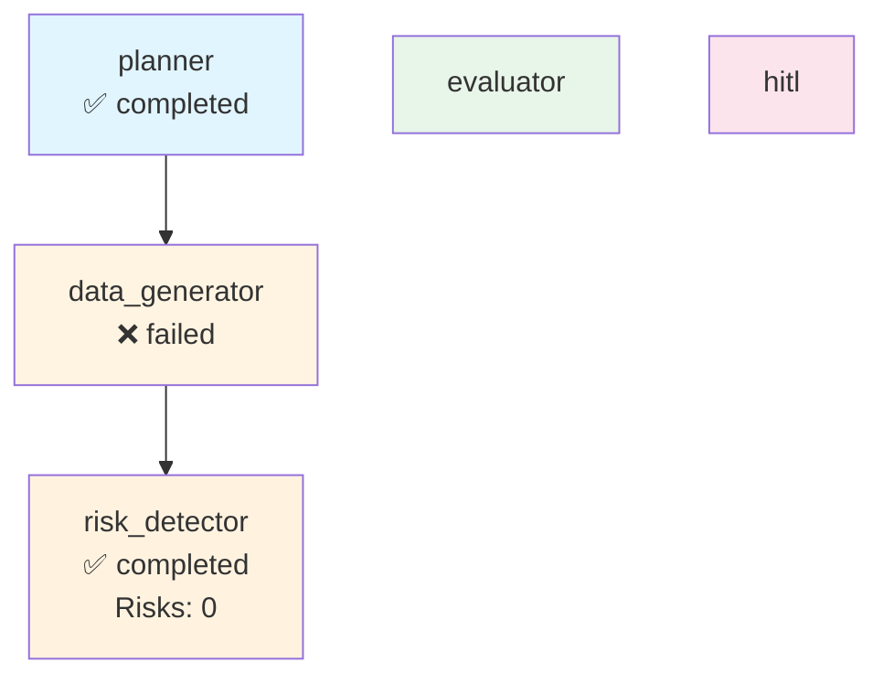

# Execution Trace - anysphere

**Run ID:** 78aa3022-7ced-4a34-9248-41184ec51319  
**Company:** anysphere  
**Branch Taken:** normal  
**Timestamp:** 2025-11-19T16:43:11.669734

## Execution Path

### Nodes Executed

### 1. Planner

- **Status:** completed
- **Start Time:** 2025-11-19T16:43:07.515031
- **End Time:** 2025-11-19T16:43:07.519815

### 2. Data Generator

- **Status:** failed
- **Start Time:** 2025-11-19T16:43:07.521993
- **End Time:** 2025-11-19T16:43:11.657855

### 3. Risk Detector

- **Status:** completed
- **Start Time:** 2025-11-19T16:43:11.663301
- **End Time:** 2025-11-19T16:43:11.667191
- **Risks Found:** 0
- **Branch:** normal


## Decision Path

**Branch Taken:** `normal`


### Normal Flow

No risks detected. Workflow completed without HITL intervention.


## Visualization



## Complete State

```json
{
  "company_id": "anysphere",
  "plan": [
    "1. Retrieve company structured payload",
    "2. Generate dashboard via MCP",
    "3. Evaluate dashboard quality",
    "4. Detect risks and determine if HITL needed"
  ],
  "payload": {
    "company_record": {
      "company_id": "anysphere",
      "legal_name": "",
      "brand_name": null,
      "website": "https://www.cursor.com",
      "hq_city": "San Francisco",
      "hq_state": null,
      "hq_country": "United States",
      "founded_year": 2022,
      "categories": [],
      "related_companies": [],
      "total_raised_usd": null,
      "last_disclosed_valuation_usd": null,
      "last_round_name": null,
      "last_round_date": null,
      "schema_version": "2.0.0",
      "as_of": "2025-11-17",
      "provenance": [
        {
          "source_url": "https://www.cursor.com",
          "crawled_at": "2025-11-17T23:25:34.122726",
          "source_folder": "2025-11-12_daily",
          "data_files_used": [
            "blog",
            "careers"
          ],
          "snippet": "Extracted from 2025-11-12_daily data"
        }
      ]
    },
    "events": [],
    "snapshots": [
      {
        "company_id": "anysphere",
        "as_of": "2025-11-17",
        "headcount_total": null,
        "job_openings_count": 0,
        "engineering_openings": null,
        "sales_openings": null,
        "hiring_focus": [],
        "pricing_tiers": [
          "Free",
          "Hobby",
          "Plus",
          "Pro",
          "Professional",
          "Team"
        ],
        "active_products": [],
        "geo_presence": [],
        "confidence": null,
        "schema_version": "2.0.0",
        "provenance": []
      }
    ],
    "products": [],
    "leadership": [
      {
        "person_id": "person_anysphere_ceo",
        "company_id": "anysphere",
        "name": "Michael Truell",
        "role": "CEO",
        "is_founder": true,
        "previous_affiliation": null,
        "education": null,
        "linkedin": null,
        "schema_version": "2.0.0",
        "provenance": []
      }
    ],
    "visibility": [
      {
        "company_id": "anysphere",
        "as_of": "2025-11-17",
        "news_mentions_30d": null,
        "github_stars": null,
        "schema_version": "2.0.0",
        "provenance": []
      }
    ],
    "notes": "Extracted 2025-11-17",
    "provenance_policy": "Use only scraped sources. If missing: 'Not disclosed.'"
  },
  "dashboard_markdown": null,
  "dashboard_score": 0.0,
  "risk_keywords": [],
  "requires_hitl": false,
  "branch_taken": "normal",
  "error": "No dashboard to evaluate",
  "execution_path": [
    {
      "node": "planner",
      "start_time": "2025-11-19T16:43:07.515031",
      "end_time": "2025-11-19T16:43:07.519815",
      "status": "completed"
    },
    {
      "node": "data_generator",
      "start_time": "2025-11-19T16:43:07.521993",
      "end_time": "2025-11-19T16:43:11.657855",
      "status": "failed"
    },
    {
      "node": "risk_detector",
      "start_time": "2025-11-19T16:43:11.663301",
      "end_time": "2025-11-19T16:43:11.667191",
      "status": "completed",
      "risks_found": 0,
      "branch": "normal"
    }
  ],
  "metadata": {
    "run_id": "78aa3022-7ced-4a34-9248-41184ec51319",
    "planner_timestamp": "2025-11-19T16:43:07.515031",
    "risk_detection_timestamp": "2025-11-19T16:43:11.667180",
    "risk_count": 0
  }
}
```
