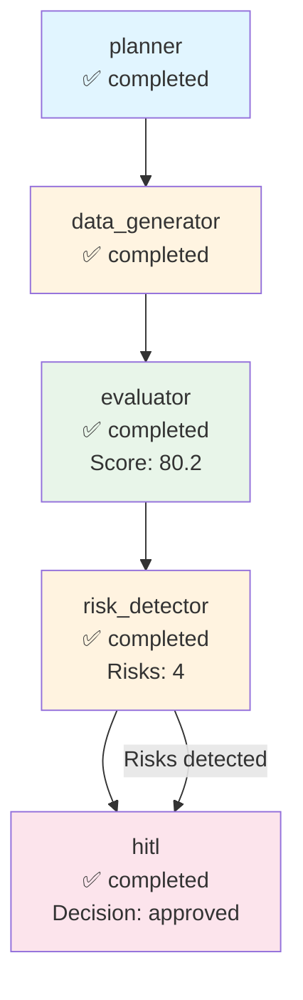

# Execution Trace - captions

**Run ID:** c9281467-52cf-473e-ba7d-c8f001f745b8  
**Company:** captions  
**Branch Taken:** hitl  
**Timestamp:** 2025-11-17T15:54:56.672451

## Execution Path

### Nodes Executed

### 1. Planner

- **Status:** completed
- **Start Time:** 2025-11-17T15:54:43.659026
- **End Time:** 2025-11-17T15:54:43.661269

### 2. Data Generator

- **Status:** completed
- **Start Time:** 2025-11-17T15:54:43.661269
- **End Time:** 2025-11-17T15:54:53.252224

### 3. Evaluator

- **Status:** completed
- **Start Time:** 2025-11-17T15:54:53.253578
- **End Time:** 2025-11-17T15:54:53.254912
- **Dashboard Score:** 80.2/100

### 4. Risk Detector

- **Status:** completed
- **Start Time:** 2025-11-17T15:54:53.256019
- **End Time:** 2025-11-17T15:54:53.257033
- **Risks Found:** 4
- **Branch:** hitl

### 5. Hitl

- **Status:** completed
- **Start Time:** 2025-11-17T15:54:53.259213
- **End Time:** 2025-11-17T15:54:56.670924
- **HITL Decision:** approved
- **Approved:** True


## Decision Path

**Branch Taken:** `hitl`


### HITL Review

- **Decision:** approved
- **Approved:** True
- **Risk Keywords:** layoff, layoffs, security incident, leadership change
- **Dashboard Score:** 80.2/100


## Visualization



## Complete State

```json
{
  "company_id": "captions",
  "plan": [
    "1. Retrieve company structured payload",
    "2. Generate dashboard via MCP",
    "3. Evaluate dashboard quality",
    "4. Detect risks and determine if HITL needed"
  ],
  "payload": {
    "company_record": {
      "company_id": "captions",
      "legal_name": "ClearCaptions",
      "brand_name": null,
      "website": "https://captions.com",
      "hq_city": "New York",
      "hq_state": null,
      "hq_country": "United States",
      "founded_year": 2021,
      "categories": [
        "Telecommunications",
        "Assistive Technology",
        "Communication Services"
      ],
      "related_companies": [
        "CaptionCall",
        "Ava",
        "Otter.ai"
      ],
      "total_raised_usd": 0.0,
      "last_disclosed_valuation_usd": 0.0,
      "last_round_name": null,
      "last_round_date": null,
      "schema_version": "2.0.0",
      "as_of": "2025-11-05",
      "provenance": [
        {
          "source_url": "https://captions.com",
          "crawled_at": "2025-11-05T19:28:47.326311",
          "snippet": "Extracted from scraped pages"
        }
      ]
    },
    "events": [],
    "snapshots": [
      {
        "company_id": "captions",
        "as_of": "2025-11-05",
        "headcount_total": null,
        "job_openings_count": 0,
        "engineering_openings": null,
        "sales_openings": null,
        "hiring_focus": [],
        "pricing_tiers": [
          "Free"
        ],
        "active_products": [],
        "geo_presence": [],
        "confidence": null,
        "schema_version": "2.0.0",
        "provenance": []
      }
    ],
    "products": [],
    "leadership": [
      {
        "person_id": "person_captions_ceo",
        "company_id": "captions",
        "name": "Gaurav Misra",
        "role": "CEO",
        "is_founder": true,
        "previous_affiliation": null,
        "education": null,
        "linkedin": null,
        "schema_version": "2.0.0",
        "provenance": []
      }
    ],
    "visibility": [
      {
        "company_id": "captions",
        "as_of": "2025-11-05",
        "news_mentions_30d": null,
        "github_stars": null,
        "schema_version": "2.0.0",
        "provenance": []
      }
    ],
    "notes": "Extracted 2025-11-05",
    "provenance_policy": "Use only scraped sources. If missing: 'Not disclosed.'"
  },
  "dashboard_markdown": "## Company Overview\n**Legal Name:** ClearCaptions  \n**Headquarters:** New York, United States  \n**Founded Year:** 2021  \n**Categories:** Telecommunications, Assistive Technology, Communication Services  \n**Competitive Positioning:** ClearCaptions operates in the telecommunications and assistive technology sectors, competing with companies such as CaptionCall, Ava, and Otter.ai.\n\n## Business Model and GTM\nClearCaptions targets consumers seeking assistive communication solutions. They offer a **Free** pricing model, although specific pricing tiers beyond this are not disclosed. There are no publicly named integration partners or reference customers at this time.\n\n## Funding & Investor Profile\nClearCaptions has not raised any funds to date, with a total raised amount of **$0.0**. There is no disclosed valuation or recent funding rounds.\n\n## Growth Momentum\nAs of the latest snapshot on November 5, 2025, ClearCaptions has **0 job openings**. There are no disclosed engineering or sales openings, indicating a potential stagnation in hiring momentum. There are no major events such as partnerships, product releases, or leadership changes reported.\n\n## Visibility & Market Sentiment\nThe visibility metrics indicate that there have been **no news mentions** in the last 30 days, and **no GitHub stars** are recorded. Therefore, the attention around ClearCaptions is currently unclear.\n\n## Risks and Challenges\n- No layoffs reported.\n- No regulatory or security incidents noted.\n- No executive churn observed.\n- No pricing pressure indicated.\n- No GTM concentration risk identified.\n\n## Outlook\nClearCaptions, led by founder and CEO Gaurav Misra, operates in a niche market within telecommunications and assistive technology. The lack of disclosed funding and job openings may suggest challenges in scaling their go-to-market strategy. The company's moat could be strengthened through unique data advantages and potential future integrations, but current visibility and market sentiment remain limited.\n\n## Disclosure Gaps\n- \"Valuation not disclosed.\"\n- \"Headcount growth not confirmed.\"\n- \"No public sentiment data.\"",
  "dashboard_score": 80.17857142857143,
  "risk_keywords": [
    "layoff",
    "layoffs",
    "security incident",
    "leadership change"
  ],
  "requires_hitl": true,
  "branch_taken": "hitl",
  "error": null,
  "execution_path": [
    {
      "node": "planner",
      "start_time": "2025-11-17T15:54:43.659026",
      "end_time": "2025-11-17T15:54:43.661269",
      "status": "completed"
    },
    {
      "node": "data_generator",
      "start_time": "2025-11-17T15:54:43.661269",
      "end_time": "2025-11-17T15:54:53.252224",
      "status": "completed"
    },
    {
      "node": "evaluator",
      "start_time": "2025-11-17T15:54:53.253578",
      "end_time": "2025-11-17T15:54:53.254912",
      "status": "completed",
      "score": 80.17857142857143
    },
    {
      "node": "risk_detector",
      "start_time": "2025-11-17T15:54:53.256019",
      "end_time": "2025-11-17T15:54:53.257033",
      "status": "completed",
      "risks_found": 4,
      "branch": "hitl"
    },
    {
      "node": "hitl",
      "start_time": "2025-11-17T15:54:53.259213",
      "end_time": "2025-11-17T15:54:56.670924",
      "status": "completed",
      "decision": "approved",
      "approved": true
    }
  ],
  "metadata": {
    "run_id": "c9281467-52cf-473e-ba7d-c8f001f745b8",
    "planner_timestamp": "2025-11-17T15:54:43.659026",
    "tokens_used": 1612,
    "evaluation_timestamp": "2025-11-17T15:54:53.254912",
    "risk_detection_timestamp": "2025-11-17T15:54:53.257033",
    "risk_count": 4,
    "hitl_approved": true,
    "hitl_decision": "approved",
    "hitl_timestamp": "2025-11-17T15:54:53.259213",
    "hitl_decision_timestamp": "2025-11-17T15:54:56.670924"
  }
}
```
