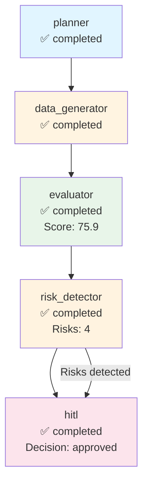

# Execution Trace - cohere

**Run ID:** 0d8e1cd5-39b1-4fa1-a9c0-8e778fdd4948  
**Company:** cohere  
**Branch Taken:** hitl  
**Timestamp:** 2025-11-17T14:59:29.119742

## Execution Path

### Nodes Executed

### 1. Planner

- **Status:** completed
- **Start Time:** 2025-11-17T14:58:53.890217
- **End Time:** 2025-11-17T14:58:53.891603

### 2. Data Generator

- **Status:** completed
- **Start Time:** 2025-11-17T14:58:53.891603
- **End Time:** 2025-11-17T14:59:04.439712

### 3. Evaluator

- **Status:** completed
- **Start Time:** 2025-11-17T14:59:04.440727
- **End Time:** 2025-11-17T14:59:04.441726
- **Dashboard Score:** 75.9/100

### 4. Risk Detector

- **Status:** completed
- **Start Time:** 2025-11-17T14:59:04.442723
- **End Time:** 2025-11-17T14:59:04.443722
- **Risks Found:** 4
- **Branch:** hitl

### 5. Hitl

- **Status:** completed
- **Start Time:** 2025-11-17T14:59:04.445727
- **End Time:** 2025-11-17T14:59:29.118626
- **HITL Decision:** approved
- **Approved:** True


## Decision Path

**Branch Taken:** `hitl`


### HITL Review

- **Decision:** approved
- **Approved:** True
- **Risk Keywords:** layoff, layoffs, security incident, leadership change
- **Dashboard Score:** 75.9/100


## Visualization



## Complete State

```json
{
  "company_id": "cohere",
  "plan": [
    "1. Retrieve company structured payload",
    "2. Generate dashboard via MCP",
    "3. Evaluate dashboard quality",
    "4. Detect risks and determine if HITL needed"
  ],
  "payload": {
    "company_record": {
      "company_id": "cohere",
      "legal_name": "Cohere",
      "brand_name": null,
      "website": "https://cohere.com",
      "hq_city": "Toronto",
      "hq_state": null,
      "hq_country": "Canada",
      "founded_year": 2019,
      "categories": [],
      "related_companies": [],
      "total_raised_usd": null,
      "last_disclosed_valuation_usd": null,
      "last_round_name": null,
      "last_round_date": null,
      "schema_version": "2.0.0",
      "as_of": "2025-11-05",
      "provenance": [
        {
          "source_url": "https://cohere.com",
          "crawled_at": "2025-11-05T19:29:03.322135",
          "snippet": "Extracted from scraped pages"
        }
      ]
    },
    "events": [],
    "snapshots": [
      {
        "company_id": "cohere",
        "as_of": "2025-11-05",
        "headcount_total": null,
        "job_openings_count": 0,
        "engineering_openings": null,
        "sales_openings": null,
        "hiring_focus": [],
        "pricing_tiers": [
          "Free",
          "Business",
          "Enterprise",
          "Scale"
        ],
        "active_products": [],
        "geo_presence": [],
        "confidence": null,
        "schema_version": "2.0.0",
        "provenance": []
      }
    ],
    "products": [],
    "leadership": [
      {
        "person_id": "person_cohere_ceo",
        "company_id": "cohere",
        "name": "Aidan Gomez",
        "role": "CEO",
        "is_founder": true,
        "previous_affiliation": null,
        "education": null,
        "linkedin": null,
        "schema_version": "2.0.0",
        "provenance": []
      }
    ],
    "visibility": [
      {
        "company_id": "cohere",
        "as_of": "2025-11-05",
        "news_mentions_30d": null,
        "github_stars": null,
        "schema_version": "2.0.0",
        "provenance": []
      }
    ],
    "notes": "Extracted 2025-11-05",
    "provenance_policy": "Use only scraped sources. If missing: 'Not disclosed.'"
  },
  "dashboard_markdown": "## Company Overview\nCohere is a private AI startup headquartered in Toronto, Canada. Founded in 2019, the company focuses on artificial intelligence, although specific categories are not disclosed. The competitive positioning of Cohere is not detailed in the provided information.\n\n## Business Model and GTM\nCohere sells its services through a tiered pricing model that includes the following tiers: Free, Business, Enterprise, and Scale. The specific target customers and integration partners are not disclosed.\n\n## Funding & Investor Profile\nThere is no disclosed funding history for Cohere, as the total raised amount, last round name, and last disclosed valuation are all not available.\n\n## Growth Momentum\nAs of November 5, 2025, Cohere has not disclosed its total headcount and has no current job openings. There are no significant events such as partnerships, product releases, or leadership changes reported.\n\n## Visibility & Market Sentiment\nCohere's visibility metrics indicate that there have been no news mentions in the past 30 days, and the number of GitHub stars is also not disclosed. Therefore, the attention around the company is unclear.\n\n## Risks and Challenges\nThere are no specific downside signals reported, such as layoffs, regulatory/security incidents, executive churn, pricing pressure, or GTM concentration risk.\n\n## Outlook\nCohere's outlook appears restrained due to the lack of disclosed information regarding its market presence and growth metrics. The company's moat may be influenced by its founder, Aidan Gomez, who is a co-founder and CEO. However, the absence of hiring activity and product details raises questions about its go-to-market strategy and scaling potential.\n\n## Disclosure Gaps\n- \"Valuation not disclosed.\"\n- \"Total raised amount not disclosed.\"\n- \"Headcount growth not confirmed.\"\n- \"No public sentiment data.\"",
  "dashboard_score": 75.89285714285714,
  "risk_keywords": [
    "layoff",
    "layoffs",
    "security incident",
    "leadership change"
  ],
  "requires_hitl": true,
  "branch_taken": "hitl",
  "error": null,
  "execution_path": [
    {
      "node": "planner",
      "start_time": "2025-11-17T14:58:53.890217",
      "end_time": "2025-11-17T14:58:53.891603",
      "status": "completed"
    },
    {
      "node": "data_generator",
      "start_time": "2025-11-17T14:58:53.891603",
      "end_time": "2025-11-17T14:59:04.439712",
      "status": "completed"
    },
    {
      "node": "evaluator",
      "start_time": "2025-11-17T14:59:04.440727",
      "end_time": "2025-11-17T14:59:04.441726",
      "status": "completed",
      "score": 75.89285714285714
    },
    {
      "node": "risk_detector",
      "start_time": "2025-11-17T14:59:04.442723",
      "end_time": "2025-11-17T14:59:04.443722",
      "status": "completed",
      "risks_found": 4,
      "branch": "hitl"
    },
    {
      "node": "hitl",
      "start_time": "2025-11-17T14:59:04.445727",
      "end_time": "2025-11-17T14:59:29.118626",
      "status": "completed",
      "decision": "approved",
      "approved": true
    }
  ],
  "metadata": {
    "run_id": "0d8e1cd5-39b1-4fa1-a9c0-8e778fdd4948",
    "planner_timestamp": "2025-11-17T14:58:53.890217",
    "tokens_used": 1527,
    "evaluation_timestamp": "2025-11-17T14:59:04.441726",
    "risk_detection_timestamp": "2025-11-17T14:59:04.443722",
    "risk_count": 4,
    "hitl_approved": true,
    "hitl_decision": "approved",
    "hitl_timestamp": "2025-11-17T14:59:04.445727",
    "hitl_decision_timestamp": "2025-11-17T14:59:29.118626"
  }
}
```
