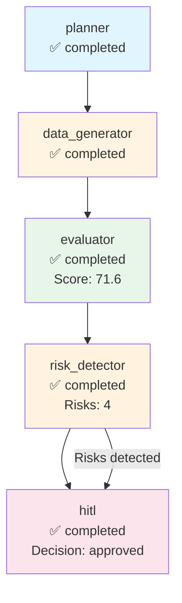

# Execution Trace - cohere

**Run ID:** 10dc5b3d-1489-4cfd-aff7-be3e27e9dbd6  
**Company:** cohere  
**Branch Taken:** hitl  
**Timestamp:** 2025-11-17T15:34:55.887581

## Execution Path

### Nodes Executed

### 1. Planner

- **Status:** completed
- **Start Time:** 2025-11-17T15:33:41.506700
- **End Time:** 2025-11-17T15:33:41.507701

### 2. Data Generator

- **Status:** completed
- **Start Time:** 2025-11-17T15:33:41.509864
- **End Time:** 2025-11-17T15:33:52.654945

### 3. Evaluator

- **Status:** completed
- **Start Time:** 2025-11-17T15:33:52.656085
- **End Time:** 2025-11-17T15:33:52.657097
- **Dashboard Score:** 71.6/100

### 4. Risk Detector

- **Status:** completed
- **Start Time:** 2025-11-17T15:33:52.662989
- **End Time:** 2025-11-17T15:33:52.662989
- **Risks Found:** 4
- **Branch:** hitl

### 5. Hitl

- **Status:** completed
- **Start Time:** 2025-11-17T15:33:52.665083
- **End Time:** 2025-11-17T15:34:55.886291
- **HITL Decision:** approved
- **Approved:** True


## Decision Path

**Branch Taken:** `hitl`


### HITL Review

- **Decision:** approved
- **Approved:** True
- **Risk Keywords:** layoff, layoffs, security incident, leadership change
- **Dashboard Score:** 71.6/100


## Visualization



## Complete State

```json
{
  "company_id": "cohere",
  "plan": [
    "1. Retrieve company structured payload",
    "2. Generate dashboard via MCP",
    "3. Evaluate dashboard quality",
    "4. Detect risks and determine if HITL needed"
  ],
  "payload": {
    "company_record": {
      "company_id": "cohere",
      "legal_name": "Cohere",
      "brand_name": null,
      "website": "https://cohere.com",
      "hq_city": "Toronto",
      "hq_state": null,
      "hq_country": "Canada",
      "founded_year": 2019,
      "categories": [],
      "related_companies": [],
      "total_raised_usd": null,
      "last_disclosed_valuation_usd": null,
      "last_round_name": null,
      "last_round_date": null,
      "schema_version": "2.0.0",
      "as_of": "2025-11-05",
      "provenance": [
        {
          "source_url": "https://cohere.com",
          "crawled_at": "2025-11-05T19:29:03.322135",
          "snippet": "Extracted from scraped pages"
        }
      ]
    },
    "events": [],
    "snapshots": [
      {
        "company_id": "cohere",
        "as_of": "2025-11-05",
        "headcount_total": null,
        "job_openings_count": 0,
        "engineering_openings": null,
        "sales_openings": null,
        "hiring_focus": [],
        "pricing_tiers": [
          "Free",
          "Business",
          "Enterprise",
          "Scale"
        ],
        "active_products": [],
        "geo_presence": [],
        "confidence": null,
        "schema_version": "2.0.0",
        "provenance": []
      }
    ],
    "products": [],
    "leadership": [
      {
        "person_id": "person_cohere_ceo",
        "company_id": "cohere",
        "name": "Aidan Gomez",
        "role": "CEO",
        "is_founder": true,
        "previous_affiliation": null,
        "education": null,
        "linkedin": null,
        "schema_version": "2.0.0",
        "provenance": []
      }
    ],
    "visibility": [
      {
        "company_id": "cohere",
        "as_of": "2025-11-05",
        "news_mentions_30d": null,
        "github_stars": null,
        "schema_version": "2.0.0",
        "provenance": []
      }
    ],
    "notes": "Extracted 2025-11-05",
    "provenance_policy": "Use only scraped sources. If missing: 'Not disclosed.'"
  },
  "dashboard_markdown": "## Company Overview\nCohere is a private AI startup headquartered in Toronto, Canada. Founded in 2019, the company focuses on artificial intelligence, although specific categories have not been disclosed. The competitive positioning of the company is not detailed in the available information.\n\n## Business Model and GTM\nCohere sells its services using a tiered pricing model, which includes the following tiers: Free, Business, Enterprise, and Scale. Specific details about their target customers, integration partners, or reference customers are not disclosed.\n\n## Funding & Investor Profile\nCohere's funding history is not available, as there are no recorded funding events. The total amount raised, last round name, and last disclosed valuation are also not disclosed.\n\n## Growth Momentum\nAs of the latest snapshot on November 5, 2025, Cohere has a total headcount that is not disclosed and currently has no job openings. There are no engineering or sales openings reported. There are no major events such as partnerships, product releases, or leadership changes documented.\n\n## Visibility & Market Sentiment\nCohere's visibility metrics indicate that there have been no news mentions in the last 30 days, and the number of GitHub stars is not disclosed. Therefore, the current attention on the company is unclear.\n\n## Risks and Challenges\nNo specific risks or challenges are indicated in the available data. There are no reports of layoffs, regulatory or security incidents, executive churn, pricing pressure, or GTM concentration risk.\n\n## Outlook\nCohere's outlook is restrained, given the lack of disclosed information regarding its market presence and growth momentum. The founder, Aidan Gomez, is noted as a key leadership figure, but further details on the company's data advantage, integrations, or macroeconomic fit are not available.\n\n## Disclosure Gaps\n- \"Valuation not disclosed.\"\n- \"Total raised amount not disclosed.\"\n- \"Headcount growth not confirmed.\"\n- \"No public sentiment data.\"\n- \"No details on active products or partnerships.\"",
  "dashboard_score": 71.60714285714286,
  "risk_keywords": [
    "layoff",
    "layoffs",
    "security incident",
    "leadership change"
  ],
  "requires_hitl": true,
  "branch_taken": "hitl",
  "error": null,
  "execution_path": [
    {
      "node": "planner",
      "start_time": "2025-11-17T15:33:41.506700",
      "end_time": "2025-11-17T15:33:41.507701",
      "status": "completed"
    },
    {
      "node": "data_generator",
      "start_time": "2025-11-17T15:33:41.509864",
      "end_time": "2025-11-17T15:33:52.654945",
      "status": "completed"
    },
    {
      "node": "evaluator",
      "start_time": "2025-11-17T15:33:52.656085",
      "end_time": "2025-11-17T15:33:52.657097",
      "status": "completed",
      "score": 71.60714285714286
    },
    {
      "node": "risk_detector",
      "start_time": "2025-11-17T15:33:52.662989",
      "end_time": "2025-11-17T15:33:52.662989",
      "status": "completed",
      "risks_found": 4,
      "branch": "hitl"
    },
    {
      "node": "hitl",
      "start_time": "2025-11-17T15:33:52.665083",
      "end_time": "2025-11-17T15:34:55.886291",
      "status": "completed",
      "decision": "approved",
      "approved": true
    }
  ],
  "metadata": {
    "run_id": "10dc5b3d-1489-4cfd-aff7-be3e27e9dbd6",
    "planner_timestamp": "2025-11-17T15:33:41.506700",
    "tokens_used": 1565,
    "evaluation_timestamp": "2025-11-17T15:33:52.657097",
    "risk_detection_timestamp": "2025-11-17T15:33:52.662989",
    "risk_count": 4,
    "hitl_approved": true,
    "hitl_decision": "approved",
    "hitl_timestamp": "2025-11-17T15:33:52.665083",
    "hitl_decision_timestamp": "2025-11-17T15:34:55.886291"
  }
}
```
