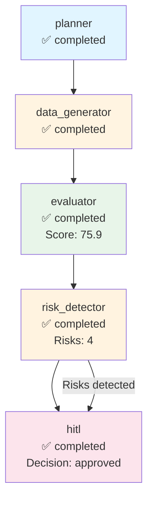

# Execution Trace - cohere

**Run ID:** 872cbbed-ac60-44b5-982b-f15b4dd3859f  
**Company:** cohere  
**Branch Taken:** hitl  
**Timestamp:** 2025-11-17T16:06:18.749421

## Execution Path

### Nodes Executed

### 1. Planner

- **Status:** completed
- **Start Time:** 2025-11-17T16:05:51.059297
- **End Time:** 2025-11-17T16:05:51.060492

### 2. Data Generator

- **Status:** completed
- **Start Time:** 2025-11-17T16:05:51.061491
- **End Time:** 2025-11-17T16:06:04.215406

### 3. Evaluator

- **Status:** completed
- **Start Time:** 2025-11-17T16:06:04.217929
- **End Time:** 2025-11-17T16:06:04.218928
- **Dashboard Score:** 75.9/100

### 4. Risk Detector

- **Status:** completed
- **Start Time:** 2025-11-17T16:06:04.220436
- **End Time:** 2025-11-17T16:06:04.222514
- **Risks Found:** 4
- **Branch:** hitl

### 5. Hitl

- **Status:** completed
- **Start Time:** 2025-11-17T16:06:04.224522
- **End Time:** 2025-11-17T16:06:18.747888
- **HITL Decision:** approved
- **Approved:** True


## Decision Path

**Branch Taken:** `hitl`


### HITL Review

- **Decision:** approved
- **Approved:** True
- **Risk Keywords:** layoff, layoffs, security incident, leadership change
- **Dashboard Score:** 75.9/100


## Visualization



## Complete State

```json
{
  "company_id": "cohere",
  "plan": [
    "1. Retrieve company structured payload",
    "2. Generate dashboard via MCP",
    "3. Evaluate dashboard quality",
    "4. Detect risks and determine if HITL needed"
  ],
  "payload": {
    "company_record": {
      "company_id": "cohere",
      "legal_name": "Cohere",
      "brand_name": null,
      "website": "https://cohere.com",
      "hq_city": "Toronto",
      "hq_state": null,
      "hq_country": "Canada",
      "founded_year": 2019,
      "categories": [],
      "related_companies": [],
      "total_raised_usd": null,
      "last_disclosed_valuation_usd": null,
      "last_round_name": null,
      "last_round_date": null,
      "schema_version": "2.0.0",
      "as_of": "2025-11-05",
      "provenance": [
        {
          "source_url": "https://cohere.com",
          "crawled_at": "2025-11-05T19:29:03.322135",
          "snippet": "Extracted from scraped pages"
        }
      ]
    },
    "events": [],
    "snapshots": [
      {
        "company_id": "cohere",
        "as_of": "2025-11-05",
        "headcount_total": null,
        "job_openings_count": 0,
        "engineering_openings": null,
        "sales_openings": null,
        "hiring_focus": [],
        "pricing_tiers": [
          "Free",
          "Business",
          "Enterprise",
          "Scale"
        ],
        "active_products": [],
        "geo_presence": [],
        "confidence": null,
        "schema_version": "2.0.0",
        "provenance": []
      }
    ],
    "products": [],
    "leadership": [
      {
        "person_id": "person_cohere_ceo",
        "company_id": "cohere",
        "name": "Aidan Gomez",
        "role": "CEO",
        "is_founder": true,
        "previous_affiliation": null,
        "education": null,
        "linkedin": null,
        "schema_version": "2.0.0",
        "provenance": []
      }
    ],
    "visibility": [
      {
        "company_id": "cohere",
        "as_of": "2025-11-05",
        "news_mentions_30d": null,
        "github_stars": null,
        "schema_version": "2.0.0",
        "provenance": []
      }
    ],
    "notes": "Extracted 2025-11-05",
    "provenance_policy": "Use only scraped sources. If missing: 'Not disclosed.'"
  },
  "dashboard_markdown": "## Company Overview\n**Cohere** is a private AI startup based in **Toronto, Canada**. Founded in **2019**, the company operates in the AI sector. Competitive positioning details are **not disclosed**.\n\n## Business Model and GTM\nCohere sells to a variety of customers, with a pricing model that includes multiple tiers: **Free**, **Business**, **Enterprise**, and **Scale**. Specific integration partners and reference customers are **not disclosed**.\n\n## Funding & Investor Profile\nCohere's funding history is **not disclosed**. The total amount raised, last round name, and last disclosed valuation are also **not disclosed**.\n\n## Growth Momentum\nAs of the latest snapshot on **November 5, 2025**, Cohere has a total headcount of **not disclosed** and currently has **0 job openings**. There are no engineering or sales openings reported. There have been no major events such as partnerships, product releases, or leadership changes reported.\n\n## Visibility & Market Sentiment\nCohere's visibility metrics show **not disclosed** news mentions in the last 30 days and **not disclosed** GitHub stars. Therefore, the attention around the company is **unclear**.\n\n## Risks and Challenges\nThere are no reported risks or challenges such as layoffs, regulatory/security incidents, executive churn, pricing pressure, or GTM concentration risk.\n\n## Outlook\nCohere's outlook appears restrained given the lack of disclosed metrics. The company's moat could potentially stem from its founder, **Aidan Gomez**, who is also the CEO and a founder. However, the absence of hiring momentum and visibility metrics raises questions about its growth trajectory and market fit.\n\n## Disclosure Gaps\n- \"Valuation not disclosed.\"\n- \"Total raised not disclosed.\"\n- \"Headcount growth not confirmed.\"\n- \"No public sentiment data.\"",
  "dashboard_score": 75.89285714285714,
  "risk_keywords": [
    "layoff",
    "layoffs",
    "security incident",
    "leadership change"
  ],
  "requires_hitl": true,
  "branch_taken": "hitl",
  "error": null,
  "execution_path": [
    {
      "node": "planner",
      "start_time": "2025-11-17T16:05:51.059297",
      "end_time": "2025-11-17T16:05:51.060492",
      "status": "completed"
    },
    {
      "node": "data_generator",
      "start_time": "2025-11-17T16:05:51.061491",
      "end_time": "2025-11-17T16:06:04.215406",
      "status": "completed"
    },
    {
      "node": "evaluator",
      "start_time": "2025-11-17T16:06:04.217929",
      "end_time": "2025-11-17T16:06:04.218928",
      "status": "completed",
      "score": 75.89285714285714
    },
    {
      "node": "risk_detector",
      "start_time": "2025-11-17T16:06:04.220436",
      "end_time": "2025-11-17T16:06:04.222514",
      "status": "completed",
      "risks_found": 4,
      "branch": "hitl"
    },
    {
      "node": "hitl",
      "start_time": "2025-11-17T16:06:04.224522",
      "end_time": "2025-11-17T16:06:18.747888",
      "status": "completed",
      "decision": "approved",
      "approved": true
    }
  ],
  "metadata": {
    "run_id": "872cbbed-ac60-44b5-982b-f15b4dd3859f",
    "planner_timestamp": "2025-11-17T16:05:51.059297",
    "tokens_used": 1538,
    "evaluation_timestamp": "2025-11-17T16:06:04.218928",
    "risk_detection_timestamp": "2025-11-17T16:06:04.222514",
    "risk_count": 4,
    "hitl_approved": true,
    "hitl_decision": "approved",
    "hitl_timestamp": "2025-11-17T16:06:04.224522",
    "hitl_decision_timestamp": "2025-11-17T16:06:18.747888"
  }
}
```
