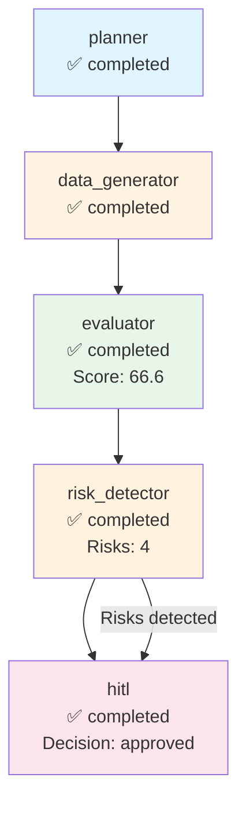

# Execution Trace - cohere

**Run ID:** 983eb7aa-4ab4-4d7f-b883-1543c516fbbf  
**Company:** cohere  
**Branch Taken:** hitl  
**Timestamp:** 2025-11-21T12:59:20.298123

## Execution Path

### Nodes Executed

### 1. Planner

- **Status:** completed
- **Start Time:** 2025-11-21T12:59:03.592446
- **End Time:** 2025-11-21T12:59:03.593448

### 2. Data Generator

- **Status:** completed
- **Start Time:** 2025-11-21T12:59:03.594446
- **End Time:** 2025-11-21T12:59:14.105523

### 3. Evaluator

- **Status:** completed
- **Start Time:** 2025-11-21T12:59:14.106028
- **End Time:** 2025-11-21T12:59:14.107039
- **Dashboard Score:** 66.6/100

### 4. Risk Detector

- **Status:** completed
- **Start Time:** 2025-11-21T12:59:14.107039
- **End Time:** 2025-11-21T12:59:14.108544
- **Risks Found:** 4
- **Branch:** hitl

### 5. Hitl

- **Status:** completed
- **Start Time:** 2025-11-21T12:59:14.109564
- **End Time:** 2025-11-21T12:59:20.297125
- **HITL Decision:** approved
- **Approved:** True


## Decision Path

**Branch Taken:** `hitl`


### HITL Review

- **Decision:** approved
- **Approved:** True
- **Risk Keywords:** layoff, layoffs, security incident, leadership change
- **Dashboard Score:** 66.6/100


## Visualization



## Complete State

```json
{
  "company_id": "cohere",
  "plan": [
    "1. Retrieve company structured payload",
    "2. Generate dashboard via MCP",
    "3. Evaluate dashboard quality",
    "4. Detect risks and determine if HITL needed"
  ],
  "payload": {
    "company_record": {
      "company_id": "cohere",
      "legal_name": "Cohere",
      "brand_name": null,
      "website": "https://cohere.com",
      "hq_city": "Toronto",
      "hq_state": null,
      "hq_country": "Canada",
      "founded_year": 2019,
      "categories": [
        "Artificial Intelligence",
        "Technology"
      ],
      "related_companies": [],
      "total_raised_usd": null,
      "last_disclosed_valuation_usd": null,
      "last_round_name": null,
      "last_round_date": null,
      "schema_version": "2.0.0",
      "as_of": "2025-11-21",
      "provenance": [
        {
          "source_url": "https://cohere.com",
          "crawled_at": "2025-11-21T02:21:32.702023",
          "source_folder": "2025-11-12_daily",
          "data_files_used": [
            "blog",
            "careers",
            "news"
          ],
          "snippet": "Extracted from 2025-11-12_daily data"
        }
      ]
    },
    "events": [],
    "snapshots": [
      {
        "company_id": "cohere",
        "as_of": "2025-11-21",
        "headcount_total": null,
        "job_openings_count": 0,
        "engineering_openings": null,
        "sales_openings": null,
        "hiring_focus": [],
        "pricing_tiers": [],
        "active_products": [],
        "geo_presence": [
          "Canada",
          "United States",
          "United Kingdom",
          "France",
          "South Korea"
        ],
        "confidence": null,
        "schema_version": "2.0.0",
        "provenance": [
          {
            "source_url": "https://cohere.ai/careers",
            "crawled_at": "2023-10-01T12:00:00Z",
            "source_folder": null,
            "data_files_used": null,
            "snippet": "Cohere careers page details about job openings and company culture."
          }
        ]
      }
    ],
    "products": [],
    "leadership": [
      {
        "person_id": "person_cohere_ceo",
        "company_id": "cohere",
        "name": "Aidan Gomez",
        "role": "CEO",
        "is_founder": true,
        "previous_affiliation": null,
        "education": null,
        "linkedin": null,
        "schema_version": "2.0.0",
        "provenance": []
      }
    ],
    "visibility": [
      {
        "company_id": "cohere",
        "as_of": "2025-11-21",
        "news_mentions_30d": null,
        "github_stars": null,
        "schema_version": "2.0.0",
        "provenance": []
      }
    ],
    "notes": "Extracted 2025-11-21",
    "provenance_policy": "Use only scraped sources. If missing: 'Not disclosed.'"
  },
  "dashboard_markdown": "## Company Overview\nCohere is a private AI startup based in Toronto, Canada, founded in 2019. The company operates in the Artificial Intelligence and Technology categories. Competitive positioning details are not disclosed.\n\n## Business Model and GTM\nCohere's target customers and pricing model are not disclosed. There are currently no publicly named integration partners or reference customers.\n\n## Funding & Investor Profile\nCohere's funding history is not disclosed, including details on any funding rounds, amounts raised, or investors. The total amount raised and last disclosed valuation are also not available.\n\n## Growth Momentum\nAs of November 21, 2025, Cohere has a total headcount that is not disclosed and currently has 0 job openings. There are no specific engineering or sales openings reported. There are no major events such as partnerships, product releases, or leadership changes to report.\n\n## Visibility & Market Sentiment\nCohere's visibility metrics indicate that news mentions in the last 30 days and GitHub stars are not disclosed. Therefore, the current attention level is unclear.\n\n## Risks and Challenges\nThere are no disclosed risks or challenges such as layoffs, regulatory/security incidents, executive churn, pricing pressure, or go-to-market concentration risk.\n\n## Outlook\nCohere's outlook remains cautious due to the lack of disclosed information regarding funding, growth, and market presence. The company's moat, potential data advantages, and founder pedigree are not detailed, making it difficult to assess the scalability of their go-to-market strategy.\n\n## Disclosure Gaps\n- \"Valuation not disclosed.\"\n- \"Total amount raised not disclosed.\"\n- \"Headcount growth not confirmed.\"\n- \"No public sentiment data.\"\n- \"Target customers and pricing model not disclosed.\"",
  "dashboard_score": 66.60714285714286,
  "risk_keywords": [
    "layoff",
    "layoffs",
    "security incident",
    "leadership change"
  ],
  "requires_hitl": true,
  "branch_taken": "hitl",
  "error": null,
  "execution_path": [
    {
      "node": "planner",
      "start_time": "2025-11-21T12:59:03.592446",
      "end_time": "2025-11-21T12:59:03.593448",
      "status": "completed"
    },
    {
      "node": "data_generator",
      "start_time": "2025-11-21T12:59:03.594446",
      "end_time": "2025-11-21T12:59:14.105523",
      "status": "completed"
    },
    {
      "node": "evaluator",
      "start_time": "2025-11-21T12:59:14.106028",
      "end_time": "2025-11-21T12:59:14.107039",
      "status": "completed",
      "score": 66.60714285714286
    },
    {
      "node": "risk_detector",
      "start_time": "2025-11-21T12:59:14.107039",
      "end_time": "2025-11-21T12:59:14.108544",
      "status": "completed",
      "risks_found": 4,
      "branch": "hitl"
    },
    {
      "node": "hitl",
      "start_time": "2025-11-21T12:59:14.109564",
      "end_time": "2025-11-21T12:59:20.297125",
      "status": "completed",
      "decision": "approved",
      "approved": true
    }
  ],
  "metadata": {
    "run_id": "983eb7aa-4ab4-4d7f-b883-1543c516fbbf",
    "planner_timestamp": "2025-11-21T12:59:03.592446",
    "tokens_used": 1648,
    "evaluation_timestamp": "2025-11-21T12:59:14.107039",
    "risk_detection_timestamp": "2025-11-21T12:59:14.108544",
    "risk_count": 4,
    "hitl_approved": true,
    "hitl_decision": "approved",
    "hitl_timestamp": "2025-11-21T12:59:14.109564",
    "hitl_decision_timestamp": "2025-11-21T12:59:20.297125"
  }
}
```
