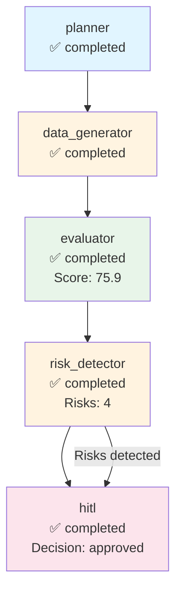

# Execution Trace - databricks

**Run ID:** f1b46555-0946-415d-a44a-533e5b5b2e6a  
**Company:** databricks  
**Branch Taken:** hitl  
**Timestamp:** 2025-11-17T15:00:51.610019

## Execution Path

### Nodes Executed

### 1. Planner

- **Status:** completed
- **Start Time:** 2025-11-17T15:00:14.389793
- **End Time:** 2025-11-17T15:00:14.390793

### 2. Data Generator

- **Status:** completed
- **Start Time:** 2025-11-17T15:00:14.391793
- **End Time:** 2025-11-17T15:00:29.754593

### 3. Evaluator

- **Status:** completed
- **Start Time:** 2025-11-17T15:00:29.755779
- **End Time:** 2025-11-17T15:00:29.757262
- **Dashboard Score:** 75.9/100

### 4. Risk Detector

- **Status:** completed
- **Start Time:** 2025-11-17T15:00:29.758261
- **End Time:** 2025-11-17T15:00:29.758261
- **Risks Found:** 4
- **Branch:** hitl

### 5. Hitl

- **Status:** completed
- **Start Time:** 2025-11-17T15:00:29.760541
- **End Time:** 2025-11-17T15:00:51.608019
- **HITL Decision:** approved
- **Approved:** True


## Decision Path

**Branch Taken:** `hitl`


### HITL Review

- **Decision:** approved
- **Approved:** True
- **Risk Keywords:** layoff, layoffs, security incident, leadership change
- **Dashboard Score:** 75.9/100


## Visualization



## Complete State

```json
{
  "company_id": "databricks",
  "plan": [
    "1. Retrieve company structured payload",
    "2. Generate dashboard via MCP",
    "3. Evaluate dashboard quality",
    "4. Detect risks and determine if HITL needed"
  ],
  "payload": {
    "company_record": {
      "company_id": "databricks",
      "legal_name": "Databricks, Inc.",
      "brand_name": null,
      "website": "https://www.databricks.com",
      "hq_city": "San Francisco",
      "hq_state": null,
      "hq_country": "United States",
      "founded_year": 2013,
      "categories": [
        "Data Analytics",
        "Machine Learning",
        "Big Data"
      ],
      "related_companies": [],
      "total_raised_usd": null,
      "last_disclosed_valuation_usd": null,
      "last_round_name": null,
      "last_round_date": null,
      "schema_version": "2.0.0",
      "as_of": "2025-11-05",
      "provenance": [
        {
          "source_url": "https://www.databricks.com",
          "crawled_at": "2025-11-05T19:29:15.726424",
          "snippet": "Extracted from scraped pages"
        }
      ]
    },
    "events": [],
    "snapshots": [
      {
        "company_id": "databricks",
        "as_of": "2025-11-05",
        "headcount_total": null,
        "job_openings_count": 0,
        "engineering_openings": null,
        "sales_openings": null,
        "hiring_focus": [],
        "pricing_tiers": [
          "Free"
        ],
        "active_products": [],
        "geo_presence": [],
        "confidence": null,
        "schema_version": "2.0.0",
        "provenance": []
      }
    ],
    "products": [],
    "leadership": [
      {
        "person_id": "person_databricks_ceo",
        "company_id": "databricks",
        "name": "Ali Ghodsi",
        "role": "CEO",
        "is_founder": true,
        "previous_affiliation": null,
        "education": null,
        "linkedin": null,
        "schema_version": "2.0.0",
        "provenance": []
      }
    ],
    "visibility": [
      {
        "company_id": "databricks",
        "as_of": "2025-11-05",
        "news_mentions_30d": null,
        "github_stars": null,
        "schema_version": "2.0.0",
        "provenance": []
      }
    ],
    "notes": "Extracted 2025-11-05",
    "provenance_policy": "Use only scraped sources. If missing: 'Not disclosed.'"
  },
  "dashboard_markdown": "## Company Overview\n**Legal Name:** Databricks, Inc.  \n**HQ:** San Francisco, United States  \n**Founded:** 2013  \n**Categories:** Data Analytics, Machine Learning, Big Data  \n**Competitive Positioning:** Not disclosed.\n\n## Business Model and GTM\nThe company sells to businesses in need of data analytics and machine learning solutions. They offer a **Free** pricing model. Integration partners and reference customers are not disclosed.\n\n## Funding & Investor Profile\nFunding history is not available as there are no recorded funding events. The total amount raised and last disclosed valuation are also not disclosed.\n\n## Growth Momentum\nAs of the latest snapshot on November 5, 2025, the company has a total headcount that is not disclosed and currently has **0** job openings. There are no engineering or sales openings reported. No major events such as partnerships, product releases, or leadership changes have been recorded.\n\n## Visibility & Market Sentiment\nThe visibility metrics show that news mentions in the last 30 days and GitHub stars are not disclosed. Therefore, the attention is unclear.\n\n## Risks and Challenges\nThere are no reported risks such as layoffs, regulatory/security incidents, executive churn, pricing pressure, or GTM concentration risk.\n\n## Outlook\nThe company is led by CEO Ali Ghodsi, who is a founder, suggesting a strong leadership pedigree. However, with no current job openings and limited disclosed information, the growth momentum and market fit remain uncertain. The lack of disclosed funding history and visibility metrics may pose challenges in assessing the company's market position and scaling potential.\n\n## Disclosure Gaps\n- \"Valuation not disclosed.\"\n- \"Total raised not disclosed.\"\n- \"Headcount growth not confirmed.\"\n- \"No public sentiment data.\"",
  "dashboard_score": 75.89285714285714,
  "risk_keywords": [
    "layoff",
    "layoffs",
    "security incident",
    "leadership change"
  ],
  "requires_hitl": true,
  "branch_taken": "hitl",
  "error": null,
  "execution_path": [
    {
      "node": "planner",
      "start_time": "2025-11-17T15:00:14.389793",
      "end_time": "2025-11-17T15:00:14.390793",
      "status": "completed"
    },
    {
      "node": "data_generator",
      "start_time": "2025-11-17T15:00:14.391793",
      "end_time": "2025-11-17T15:00:29.754593",
      "status": "completed"
    },
    {
      "node": "evaluator",
      "start_time": "2025-11-17T15:00:29.755779",
      "end_time": "2025-11-17T15:00:29.757262",
      "status": "completed",
      "score": 75.89285714285714
    },
    {
      "node": "risk_detector",
      "start_time": "2025-11-17T15:00:29.758261",
      "end_time": "2025-11-17T15:00:29.758261",
      "status": "completed",
      "risks_found": 4,
      "branch": "hitl"
    },
    {
      "node": "hitl",
      "start_time": "2025-11-17T15:00:29.760541",
      "end_time": "2025-11-17T15:00:51.608019",
      "status": "completed",
      "decision": "approved",
      "approved": true
    }
  ],
  "metadata": {
    "run_id": "f1b46555-0946-415d-a44a-533e5b5b2e6a",
    "planner_timestamp": "2025-11-17T15:00:14.389793",
    "tokens_used": 1534,
    "evaluation_timestamp": "2025-11-17T15:00:29.757262",
    "risk_detection_timestamp": "2025-11-17T15:00:29.758261",
    "risk_count": 4,
    "hitl_approved": true,
    "hitl_decision": "approved",
    "hitl_timestamp": "2025-11-17T15:00:29.760541",
    "hitl_decision_timestamp": "2025-11-17T15:00:51.608019"
  }
}
```
