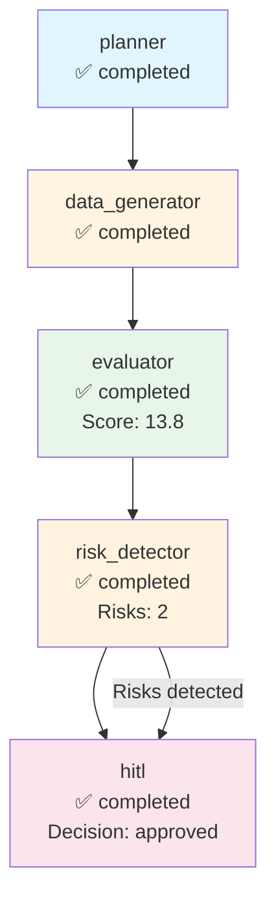

# Execution Trace - test_company

**Run ID:** a29b4f46-b4c1-4c33-b5b2-8dea4bdb6ec5  
**Company:** test_company  
**Branch Taken:** hitl  
**Timestamp:** 2025-11-18T17:56:44.038583

## Execution Path

### Nodes Executed

### 1. Planner

- **Status:** completed
- **Start Time:** 2025-11-18T17:56:44.027142
- **End Time:** 2025-11-18T17:56:44.027636

### 2. Data Generator

- **Status:** completed
- **Start Time:** 2025-11-18T17:56:44.029679
- **End Time:** 2025-11-18T17:56:44.030184

### 3. Evaluator

- **Status:** completed
- **Start Time:** 2025-11-18T17:56:44.031526
- **End Time:** 2025-11-18T17:56:44.031839
- **Dashboard Score:** 13.8/100

### 4. Risk Detector

- **Status:** completed
- **Start Time:** 2025-11-18T17:56:44.033602
- **End Time:** 2025-11-18T17:56:44.033890
- **Risks Found:** 2
- **Branch:** hitl

### 5. Hitl

- **Status:** completed
- **Start Time:** 2025-11-18T17:56:44.036370
- **End Time:** 2025-11-18T17:56:44.036693
- **HITL Decision:** approved
- **Approved:** True


## Decision Path

**Branch Taken:** `hitl`


### HITL Review

- **Decision:** approved
- **Approved:** True
- **Risk Keywords:** layoff, layoffs
- **Dashboard Score:** 13.8/100


## Visualization



## Complete State

```json
{
  "company_id": "test_company",
  "plan": [
    "1. Retrieve company structured payload",
    "2. Generate dashboard via MCP",
    "3. Evaluate dashboard quality",
    "4. Detect risks and determine if HITL needed"
  ],
  "payload": {
    "company": "test",
    "events": [
      {
        "type": "layoff",
        "title": "Mass layoffs announced"
      }
    ]
  },
  "dashboard_markdown": "# Test Company\n\nCompany announced layoffs affecting 20% of workforce.",
  "dashboard_score": 13.75,
  "risk_keywords": [
    "layoff",
    "layoffs"
  ],
  "requires_hitl": true,
  "branch_taken": "hitl",
  "error": null,
  "execution_path": [
    {
      "node": "planner",
      "start_time": "2025-11-18T17:56:44.027142",
      "end_time": "2025-11-18T17:56:44.027636",
      "status": "completed"
    },
    {
      "node": "data_generator",
      "start_time": "2025-11-18T17:56:44.029679",
      "end_time": "2025-11-18T17:56:44.030184",
      "status": "completed"
    },
    {
      "node": "evaluator",
      "start_time": "2025-11-18T17:56:44.031526",
      "end_time": "2025-11-18T17:56:44.031839",
      "status": "completed",
      "score": 13.75
    },
    {
      "node": "risk_detector",
      "start_time": "2025-11-18T17:56:44.033602",
      "end_time": "2025-11-18T17:56:44.033890",
      "status": "completed",
      "risks_found": 2,
      "branch": "hitl"
    },
    {
      "node": "hitl",
      "start_time": "2025-11-18T17:56:44.036370",
      "end_time": "2025-11-18T17:56:44.036693",
      "status": "completed",
      "decision": "approved",
      "approved": true
    }
  ],
  "metadata": {
    "run_id": "a29b4f46-b4c1-4c33-b5b2-8dea4bdb6ec5",
    "planner_timestamp": "2025-11-18T17:56:44.027142",
    "tokens_used": 500,
    "evaluation_timestamp": "2025-11-18T17:56:44.031798",
    "risk_detection_timestamp": "2025-11-18T17:56:44.033879",
    "risk_count": 2,
    "hitl_approved": true,
    "hitl_decision": "approved",
    "hitl_timestamp": "2025-11-18T17:56:44.036370",
    "hitl_decision_timestamp": "2025-11-18T17:56:44.036686"
  }
}
```
