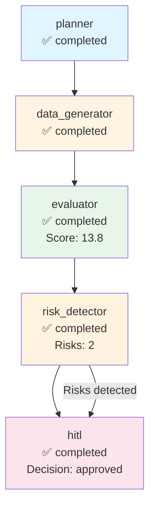

# Execution Trace - test_company

**Run ID:** 351dbad0-9692-4084-a1ef-1aea91ead6c4  
**Company:** test_company  
**Branch Taken:** hitl  
**Timestamp:** 2025-11-18T18:21:35.515071

## Execution Path

### Nodes Executed

### 1. Planner

- **Status:** completed
- **Start Time:** 2025-11-18T18:21:35.502551
- **End Time:** 2025-11-18T18:21:35.503040

### 2. Data Generator

- **Status:** completed
- **Start Time:** 2025-11-18T18:21:35.504965
- **End Time:** 2025-11-18T18:21:35.505573

### 3. Evaluator

- **Status:** completed
- **Start Time:** 2025-11-18T18:21:35.507008
- **End Time:** 2025-11-18T18:21:35.507306
- **Dashboard Score:** 13.8/100

### 4. Risk Detector

- **Status:** completed
- **Start Time:** 2025-11-18T18:21:35.509294
- **End Time:** 2025-11-18T18:21:35.509579
- **Risks Found:** 2
- **Branch:** hitl

### 5. Hitl

- **Status:** completed
- **Start Time:** 2025-11-18T18:21:35.512855
- **End Time:** 2025-11-18T18:21:35.513186
- **HITL Decision:** approved
- **Approved:** True


## Decision Path

**Branch Taken:** `hitl`


### HITL Review

- **Decision:** approved
- **Approved:** True
- **Risk Keywords:** layoff, layoffs
- **Dashboard Score:** 13.8/100


## Visualization



## Complete State

```json
{
  "company_id": "test_company",
  "plan": [
    "1. Retrieve company structured payload",
    "2. Generate dashboard via MCP",
    "3. Evaluate dashboard quality",
    "4. Detect risks and determine if HITL needed"
  ],
  "payload": {
    "company": "test",
    "events": [
      {
        "type": "layoff",
        "title": "Mass layoffs announced"
      }
    ]
  },
  "dashboard_markdown": "# Test Company\n\nCompany announced layoffs affecting 20% of workforce.",
  "dashboard_score": 13.75,
  "risk_keywords": [
    "layoff",
    "layoffs"
  ],
  "requires_hitl": true,
  "branch_taken": "hitl",
  "error": null,
  "execution_path": [
    {
      "node": "planner",
      "start_time": "2025-11-18T18:21:35.502551",
      "end_time": "2025-11-18T18:21:35.503040",
      "status": "completed"
    },
    {
      "node": "data_generator",
      "start_time": "2025-11-18T18:21:35.504965",
      "end_time": "2025-11-18T18:21:35.505573",
      "status": "completed"
    },
    {
      "node": "evaluator",
      "start_time": "2025-11-18T18:21:35.507008",
      "end_time": "2025-11-18T18:21:35.507306",
      "status": "completed",
      "score": 13.75
    },
    {
      "node": "risk_detector",
      "start_time": "2025-11-18T18:21:35.509294",
      "end_time": "2025-11-18T18:21:35.509579",
      "status": "completed",
      "risks_found": 2,
      "branch": "hitl"
    },
    {
      "node": "hitl",
      "start_time": "2025-11-18T18:21:35.512855",
      "end_time": "2025-11-18T18:21:35.513186",
      "status": "completed",
      "decision": "approved",
      "approved": true
    }
  ],
  "metadata": {
    "run_id": "351dbad0-9692-4084-a1ef-1aea91ead6c4",
    "planner_timestamp": "2025-11-18T18:21:35.502551",
    "tokens_used": 500,
    "evaluation_timestamp": "2025-11-18T18:21:35.507270",
    "risk_detection_timestamp": "2025-11-18T18:21:35.509566",
    "risk_count": 2,
    "hitl_approved": true,
    "hitl_decision": "approved",
    "hitl_timestamp": "2025-11-18T18:21:35.512855",
    "hitl_decision_timestamp": "2025-11-18T18:21:35.513179"
  }
}
```
