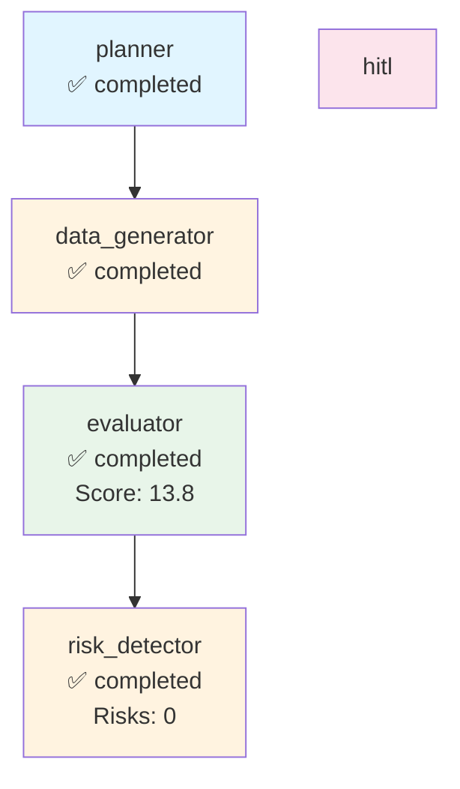

# Execution Trace - test_company

**Run ID:** a43ae217-633d-4ab8-9610-548d62c834f4  
**Company:** test_company  
**Branch Taken:** normal  
**Timestamp:** 2025-11-18T18:48:30.978594

## Execution Path

### Nodes Executed

### 1. Planner

- **Status:** completed
- **Start Time:** 2025-11-18T18:48:30.966407
- **End Time:** 2025-11-18T18:48:30.966903

### 2. Data Generator

- **Status:** completed
- **Start Time:** 2025-11-18T18:48:30.969795
- **End Time:** 2025-11-18T18:48:30.971048

### 3. Evaluator

- **Status:** completed
- **Start Time:** 2025-11-18T18:48:30.972426
- **End Time:** 2025-11-18T18:48:30.972756
- **Dashboard Score:** 13.8/100

### 4. Risk Detector

- **Status:** completed
- **Start Time:** 2025-11-18T18:48:30.974381
- **End Time:** 2025-11-18T18:48:30.974624
- **Risks Found:** 0
- **Branch:** normal


## Decision Path

**Branch Taken:** `normal`


### Normal Flow

No risks detected. Workflow completed without HITL intervention.


## Visualization



## Complete State

```json
{
  "company_id": "test_company",
  "plan": [
    "1. Retrieve company structured payload",
    "2. Generate dashboard via MCP",
    "3. Evaluate dashboard quality",
    "4. Detect risks and determine if HITL needed"
  ],
  "payload": {
    "company": "test",
    "status": "healthy"
  },
  "dashboard_markdown": "# Test Company\n\nStrong growth and positive outlook.",
  "dashboard_score": 13.75,
  "risk_keywords": [],
  "requires_hitl": false,
  "branch_taken": "normal",
  "error": null,
  "execution_path": [
    {
      "node": "planner",
      "start_time": "2025-11-18T18:48:30.966407",
      "end_time": "2025-11-18T18:48:30.966903",
      "status": "completed"
    },
    {
      "node": "data_generator",
      "start_time": "2025-11-18T18:48:30.969795",
      "end_time": "2025-11-18T18:48:30.971048",
      "status": "completed"
    },
    {
      "node": "evaluator",
      "start_time": "2025-11-18T18:48:30.972426",
      "end_time": "2025-11-18T18:48:30.972756",
      "status": "completed",
      "score": 13.75
    },
    {
      "node": "risk_detector",
      "start_time": "2025-11-18T18:48:30.974381",
      "end_time": "2025-11-18T18:48:30.974624",
      "status": "completed",
      "risks_found": 0,
      "branch": "normal"
    }
  ],
  "metadata": {
    "run_id": "a43ae217-633d-4ab8-9610-548d62c834f4",
    "planner_timestamp": "2025-11-18T18:48:30.966407",
    "tokens_used": 500,
    "evaluation_timestamp": "2025-11-18T18:48:30.972712",
    "risk_detection_timestamp": "2025-11-18T18:48:30.974612",
    "risk_count": 0
  }
}
```
